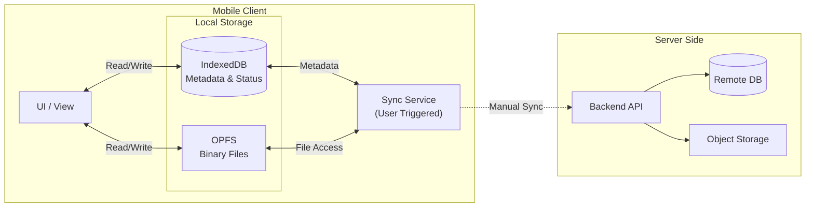
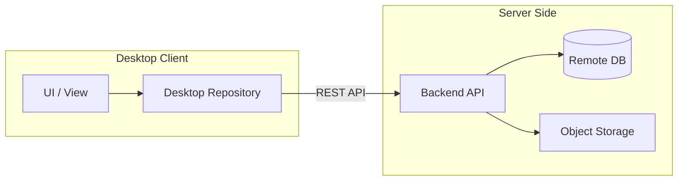
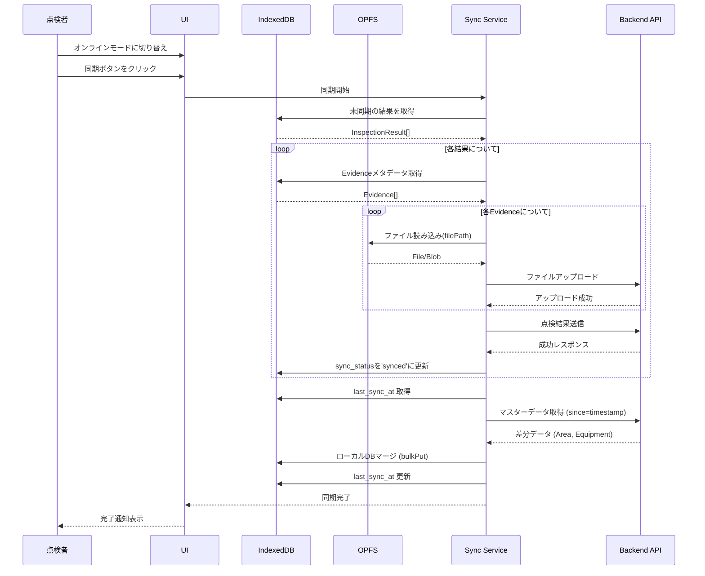

# Local Bridge - オフラインファースト点検管理システム

Local Bridge は、ネットワーク接続が不安定または完全に存在しない環境(例: 工場、倉庫、地下施設、山間部など)での**設備点検業務**を想定した、**オフラインファースト**な Web アプリケーションです。

## 🎯 なぜこのシステムが必要か

### 現場の課題

従来の点検管理システムでは、以下のような問題がありました:

1. **ネットワーク依存による作業中断**

   - 地下や建物内部など、電波が届かない場所での点検作業が多い
   - 接続が不安定な環境で、データ送信の失敗やタイムアウトが頻発
   - 「保存できない」「送信できない」というストレスで作業効率が低下

2. **大容量メディアファイルの扱いづらさ**

   - 点検では写真や動画による記録が必須
   - 従来システムでは「後でアップロード」が必要で、手間がかかる
   - アップロード待ち時間が長く、現場での作業が滞る

3. **データ消失のリスク**
   - ネットワークエラーで入力データが失われる
   - 「保存ボタン」を押し忘れてデータが消える

### Local Bridge の解決策

これらの課題を解決するため、**ユーザー体験(UX)を最優先**に設計しました:

#### 1. **完全オフライン動作 - ネットワークを気にせず作業できる**

- すべての操作がローカルで完結
- 電波がなくても、点検結果の入力・写真撮影・動画記録が可能
- データは即座にブラウザに保存され、絶対に失われない

**UX への影響**: 点検者は「接続状態」を気にする必要がなく、作業に集中できる

#### 2. **手動同期 - ユーザーがコントロールできる**

自動同期ではなく、**ユーザーが明示的に同期タイミングを選択**する設計です。

**なぜ手動か?**

- 不安定な接続での自動同期は、予期しない動作(データの重複、同期失敗)を引き起こす
- ユーザーが「今、同期する」と決められることで、安心感と透明性を提供
- バッテリー消費を抑えられる(バックグラウンド同期が不要)

**UX への影響**:

- 「いつ同期されるか分からない」不安がない
- 同期の成功/失敗が明確に分かる
- Wi-Fi 環境に移動してから同期、など柔軟な運用が可能

#### 4. **PWA 対応 - アプリとしてインストール**

- **Service Worker** によるアセットキャッシュで、オフラインでも即座に起動
- ホーム画面に追加してネイティブアプリのように利用可能
- **Web Push** 通知によるタスクアサイン通知（予定）

#### 5. **再検査ワークフロー - NG 項目のみを再チェック**

**「完了した検査は戻さない」** という原則を採用しています。

- NG 項目があった場合、その項目だけを抽出した**新しい「再検査」**を作成します。
- これにより、検査員は「やり残し」を心配することなく、目の前のリストを消化することに集中できます。
- 再検査は URL で簡単に共有でき、別の担当者に引き継ぐこともスムーズです。

#### 6. **スマートなフィルタリング - 必要な情報に集中**

- 検査詳細画面で「NG のみ」「未実施のみ」などの絞り込みが可能
- 判定結果（OK/NG）をバッジ表示し、ひと目で状況を把握

## 🏗 アーキテクチャ概要

このアプリケーションは **2 つの異なるアーキテクチャ** を採用しています。

### Mobile (点検者向け) - Local-First アーキテクチャ

オフライン環境での作業を前提とした **Local-First** 設計です。
UI は常にローカルのデータソース(IndexedDB / OPFS)のみを参照し、サーバーはデータのバックアップおよび共有先として機能します。



### Desktop (管理者向け) - Online-Only アーキテクチャ

デスクトップ環境では常時オンラインを前提とした **API 直接通信** 設計です。
UI は REST API を直接呼び出し、IndexedDB やローカルストレージは使用しません。



### Mobile vs Desktop 比較

| 観点             | Mobile (点検者)               | Desktop (管理者)               |
| ---------------- | ----------------------------- | ------------------------------ |
| ネットワーク前提 | オフラインファースト          | 常時オンライン                 |
| データソース     | IndexedDB + OPFS              | REST API 直接                  |
| 同期方式         | 手動同期 (SyncQueue)          | リアルタイム通信               |
| Repository       | `IMobileInspectionRepository` | `IDesktopInspectionRepository` |
| 主なユースケース | 現場での点検作業              | タスク管理・レビュー           |

### 主要技術スタック

#### **IndexedDB (via Dexie.js)**

- アプリケーションの「信頼できる唯一の情報源(Source of Truth)」
- 点検タスク、結果、コメント、エビデンスのメタデータを管理
- ID はサーバー採番ではなく、クライアント生成の UUID (v4)を使用し、衝突を回避

#### **OPFS (Origin Private File System)**

- 画像・動画などのバイナリデータ専用ストレージ
- IndexedDB の容量制限やパフォーマンス低下を回避
- 高速な I/O パフォーマンスを実現し、メインスレッドをブロックしない

#### **Clean Architecture**

- ドメイン駆動設計(DDD)に基づいた保守性の高い構造
- ビジネスロジックとインフラを分離
- テスタビリティと拡張性を確保

#### **Backend (Spring Boot)**

- 通常の REST API を提供
- **同期ロジックを考慮する必要はない**
  - 同期タイミング、競合解決はすべてフロントエンド側で実装
  - クライアントの状態(オンライン/オフライン)を保持しない
  - `sync_status`等のフィールドはクライアント専用
- PostgreSQL にデータを永続化し、真実の情報源として機能

## 💾 データ設計

### エンティティ

| エンティティ      | 説明                               | 保存先    |
| ----------------- | ---------------------------------- | --------- |
| Area              | 点検エリア(例: Kitchen, Hall)      | IndexedDB |
| Equipment         | 設備(例: Dishwasher, Oven)         | IndexedDB |
| InspectionTask    | 点検タスク                         | IndexedDB |
| InspectionResult  | 点検結果(OK/NG/N/A)                | IndexedDB |
| InspectionComment | コメント                           | IndexedDB |
| Evidence          | エビデンス(写真・動画)のメタデータ | IndexedDB |
| (実ファイル)      | 画像・動画の実体                   | OPFS      |

### Evidence (エビデンス) の設計

```typescript
class Evidence {
  id: string // UUID
  resultId: string // 紐づく点検結果のID
  type: "image" | "video"
  filePath: string // OPFSでのファイルパス
  mimeType: string // 'image/jpeg', 'video/mp4'等
  createdAt: number // タイムスタンプ
}
```

**ポイント**:

- メタデータ(id, type, mimeType 等)は IndexedDB に保存
- 実ファイルは OPFS に保存し、`filePath`で参照
- Base64 エンコードは使用しない(パフォーマンス重視)

## 🔄 同期ロジック

### 同期フロー



### データの同期方向

| データ種類          | 同期方向        | 説明                         |
| ------------------- | --------------- | ---------------------------- |
| Area, Equipment     | Server → Client | マスターデータ。管理者が設定 |
| InspectionTask      | Server → Client | 管理者が作成したタスク       |
| InspectionResult    | Client → Server | 点検者が登録した結果         |
| Evidence (ファイル) | Client → Server | 写真・動画をアップロード     |
| InspectionComment   | Bi-directional  | コメントは双方向同期         |

### 同期のタイミング

1. **ユーザーが「オンラインモード」に切り替え**
2. **ユーザーが「同期」ボタンをクリック**

**自動同期は行いません**。これにより:

- ユーザーが同期タイミングをコントロールできる
- 不安定な接続での予期しない動作を防ぐ
- バッテリー消費を抑える

## 📱 ユーザーロール

### デスクトップ(管理者)

- 点検タスクの作成
- タスクの進捗確認
- 点検結果のレビュー
- コメント追加

### モバイル(点検者)

- 割り当てられたタスクの確認
- 点検実施(OK/NG/N/A 判定)
- 写真・動画の撮影・添付
- コメント追加

## 🚀 Getting Started

詳細は各ディレクトリの README を参照してください:

- [Frontend README](./frontend/README.md)
- [Backend README](./backend/README.md)

## 📚 ドキュメント

- [詳細仕様書](./docs/SPECIFICATION.md) - **(New)** 機能仕様の詳細
- [技術解説記事](./TECHNICAL_ARTICLE.md) - アーキテクチャの背景と詳細
- [Frontend Architecture](./frontend/ARCHITECTURE.md) - フロントエンドの詳細設計
- [Backend Architecture](./backend/ARCHITECTURE.md) - バックエンドの詳細設計
- [Development Rules](./.agent/rules.md) - 開発ルールとガイドライン

## 🎨 UX 設計の原則

このプロジェクトでは、以下の UX 原則を重視しています:

1. **ユーザーを待たせない** - すべての操作が即座に完了
2. **データを失わせない** - 自動保存、オフライン対応
3. **透明性を保つ** - 同期状態が常に明確
4. **ユーザーにコントロールを与える** - 手動同期、明示的な操作
5. **シンプルに保つ** - 複雑な設定や操作を排除

## 📄 License

MIT License

Copyright (c) 2025 Teppei Funayama

Permission is hereby granted, free of charge, to any person obtaining a copy
of this software and associated documentation files (the "Software"), to deal
in the Software without restriction, including without limitation the rights
to use, copy, modify, merge, publish, distribute, sublicense, and/or sell
copies of the Software, and to permit persons to whom the Software is
furnished to do so, subject to the following conditions:

The above copyright notice and this permission notice shall be included in all
copies or substantial portions of the Software.

THE SOFTWARE IS PROVIDED "AS IS", WITHOUT WARRANTY OF ANY KIND, EXPRESS OR
IMPLIED, INCLUDING BUT NOT LIMITED TO THE WARRANTIES OF MERCHANTABILITY,
FITNESS FOR A PARTICULAR PURPOSE AND NONINFRINGEMENT. IN NO EVENT SHALL THE
AUTHORS OR COPYRIGHT HOLDERS BE LIABLE FOR ANY CLAIM, DAMAGES OR OTHER
LIABILITY, WHETHER IN AN ACTION OF CONTRACT, TORT OR OTHERWISE, ARISING FROM,
OUT OF OR IN CONNECTION WITH THE SOFTWARE OR THE USE OR OTHER DEALINGS IN THE
SOFTWARE.
