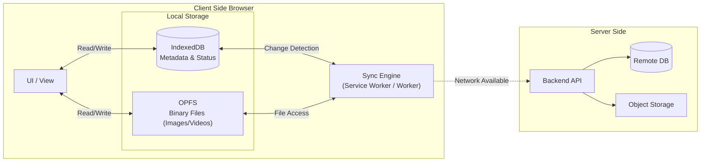

# local_bridge

local_bridge は、ネットワーク接続が不安定、または完全に存在しない環境（例：山間部、災害時、地下など）での使用を想定した **Local-First (Offline-First)** な Web アプリケーションのデモ実装です。

ユーザーが作成したデータは全てローカル環境（ブラウザ）に即座に保存され、ネットワーク接続が回復したタイミングでバックエンドと同期されます。

## 🏔 Concept

- **No Network, No Problem**
  オフライン状態でも閲覧・作成・編集の全ての機能が利用可能です。

- **Heavy Media Support**
  テキストだけでなく、画像や動画などの大容量ファイルもローカルで快適に管理します。

- **Seamless Sync**
  ユーザーは「保存ボタン」や「アップロード待ち」を意識する必要はありません。接続時に自動的に同期が行われます。

## 🏗 Architecture

このアプリケーションは **Local-First** アーキテクチャを採用しています。
UI は常にローカルのデータソース（IndexedDB / OPFS）のみを参照して描画を行います。サーバー（Backend）はあくまでデータのバックアップおよび共有先として機能します。

## Key Technologies

- **IndexedDB (via Dexie.js)**
  アプリケーションの「正（Source of Truth）」となるデータストア。JSON データ、メタデータ、同期ステータス（pending, synced）を管理します。ID にはサーバー採番ではなく、クライアント生成の UUID (v4) を使用し、衝突を回避します。

- **OPFS (Origin Private File System)**
  画像や動画などのバイナリデータを管理するために使用します。IndexedDB の容量制限やパフォーマンス低下を回避するため、ファイルシステムとして分離しています。高い I/O パフォーマンスを実現し、メインスレッドをブロックしません。

## 💾 Data Design

### IndexedDB Schema (logs Store)

| Field Name    | Type          | Description                                                                                                    |
| ------------- | ------------- | -------------------------------------------------------------------------------------------------------------- |
| `id`          | string (UUID) | PK. クライアントサイドで生成される一意な ID。                                                                  |
| `content`     | string        | ユーザーが入力したテキストデータ。                                                                             |
| `media_ids`   | string[]      | OPFS に保存されたファイル名のリスト（UUID）。                                                                  |
| `created_at`  | number        | 作成日時のタイムスタンプ。                                                                                     |
| `sync_status` | string        | 同期状態を管理。 - `pending`: 未同期（ローカルのみ） - `synced`: サーバー同期済み - `error`: 同期失敗 |

### File Storage Strategy

- **Naming Convention**: `media_ids` と紐付く UUID を使用（例: `550e8400-e29b....mp4`）。
- **Storage**: OPFS のルート、または `/assets` ディレクトリ配下にフラットに保存。

## 🔄 Synchronization Logic

1. **Detection**: ブラウザの `online` イベント、または Service Worker による定期チェックでネットワーク回復を検知。
2. **Extraction**: IndexedDB から `sync_status: 'pending'` のレコードを抽出。
3. **Upload Media**: レコードに `media_ids` が含まれる場合、OPFS からファイルを読み出し、バックエンドの Storage へアップロード。
4. **Sync Metadata**: メディアのアップロード完了後、テキストデータとメタデータを API へ POST。
5. **Completion**: サーバーからの成功レスポンスを確認後、ローカルの `sync_status` を `synced` に更新。
