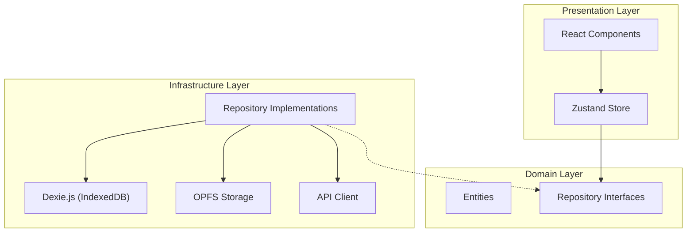
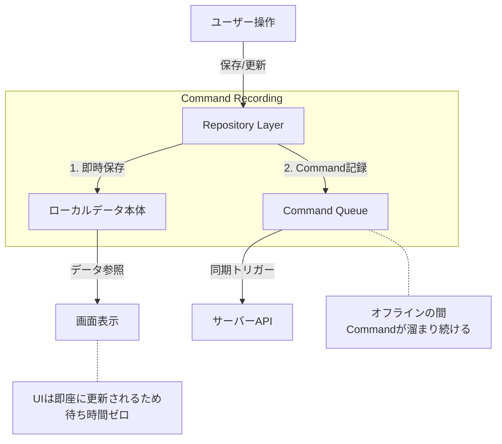

<!--
【記事のコンセプト】
- プロダクト（点検アプリ）の機能紹介ではなく、「Local-First」というアーキテクチャパターンの実践的な解説記事。
- 「待たせないUX」を実現するための技術的アプローチ（IndexedDB, OPFS, Command Pattern, Clean Architecture）に焦点を当てる。
- 読者が自身のプロジェクトでLocal-Firstを採用する際の判断材料や実装のヒントを提供することを目的とする。
- UXそのもの（再検査フローなど）よりも、そのUXを支える「設計」を重視して記述する。
-->

# 【React/TypeScript】完全オフライン動作する「Local-First」な点検アプリのアーキテクチャ設計

## はじめに

「地下の倉庫で電波が繋がらない」「山間部の現場で写真をアップロードできない」
現場 DX の文脈において、ネットワーク接続の不安定さは UX を破壊する最大の要因です。

従来の SPA（Single Page Application）は、API サーバーとの通信を前提としていました。Service Worker によるキャッシュである程度のオフライン対応は可能ですが、動的なデータの生成や保存（例：点検結果の入力、写真撮影）となると、単なるキャッシュでは対応しきれません。

そこで私たちが採用したのが **Local-First (Offline-First)** アーキテクチャです。
本記事では、**IndexedDB** と **OPFS (Origin Private File System)** を駆使し、**Clean Architecture** と **DDD (Domain-Driven Design)** の原則に基づいて構築した、堅牢なフロントエンド設計の詳細を解説します。

---

## 1. Local-First アーキテクチャの核心

Local-First とは、**「ローカルデバイス（ブラウザ）を信頼できる唯一の情報源（Source of Truth）とし、サーバーはあくまでバックアップや共有のために使う」** というパラダイムシフトです。

### 従来の Web アプリ vs Local-First

| 特徴                | 従来の Web アプリ            | Local-First アプリ              |
| ------------------- | ---------------------------- | ------------------------------- |
| **Source of Truth** | サーバー DB                  | **ローカル DB (IndexedDB)**     |
| **データ保存**      | API リクエスト (非同期)      | ローカル DB への書き込み (即時) |
| **ID 採番**         | サーバー (Auto Increment 等) | **クライアント (UUID v4)**      |
| **オフライン**      | エラーまたは Read-Only       | **Full Read/Write 可能**        |
| **レイテンシ**      | ネットワーク依存             | **ゼロ (ディスク I/O のみ)**    |

このアーキテクチャにより、ユーザーはネットワークの状態を一切気にすることなく、サクサクと作業を進めることができます。

---

## 2. 技術スタックと選定理由

- **Framework**: React 19 + TypeScript
- **Local DB**: **IndexedDB** (via **Dexie.js**)
  - _理由_: ブラウザ標準の NoSQL DB。`localStorage` (5MB 制限) とは比較にならない容量とクエリ能力を持つ。Dexie.js によるラッパーで型安全かつ直感的に扱える。
- **File Storage**: **OPFS (Origin Private File System)**
  - _理由_: 画像・動画などのバイナリデータを IndexedDB に入れるとパフォーマンスが劣化するため。ファイルシステムレベルの高速アクセスが可能。
- **State Management**: **Zustand**
  - _理由_: Redux より軽量でボイラープレートが少ない。非同期処理との相性が良く、ローカル DB との同期が書きやすい。
- **Architecture**: **Clean Architecture + DDD**
  - _理由_: 「データの保存先がローカルかサーバーか」という詳細をドメインロジックから隠蔽するため。

---

## 3. アーキテクチャ詳細：Clean Architecture の適用

フロントエンド内で Clean Architecture を適用し、依存の方向を制御しています。



### Domain Layer (中心)

ここにはビジネスロジックと型定義のみが存在します。外部ライブラリやフレームワークには依存しません。

```typescript
// src/domain/entities/Evidence.ts
export class Evidence {
  constructor(
    public readonly id: string,
    public readonly resultId: string,
    public readonly type: "image" | "video",
    public readonly filePath: string, // OPFS上のパス
    public readonly mimeType: string,
    public readonly createdAt: string // ISO 8601 UTC形式（ローカルで発行）
  ) {}
}

// src/domain/repositories/MobileInspectionRepository.ts
export interface IMobileInspectionRepository {
  saveEvidence(evidence: Evidence, file: Blob): Promise<void>
  getEvidencesByResultId(resultId: string): Promise<Evidence[]>
}
```

### Infrastructure Layer (詳細)

ここで初めて「データがどこに保存されるか」に関心を持ちます。
Local-First の肝は、**Repository の実装がまずローカル DB を読み書きする**点にあります。

```typescript
// src/infrastructure/repositories/MobileInspectionRepositoryImpl.ts
export class MobileInspectionRepositoryImpl implements IMobileInspectionRepository {
  constructor(
    private db: LocalBridgeDatabase, // Dexieインスタンス
    private opfs: OPFSStorage // OPFSラッパー
  ) {}

  async saveEvidence(evidence: Evidence, file: Blob): Promise<void> {
    // 1. バイナリはOPFSに保存 (高速)
    await this.opfs.saveFile(evidence.filePath, file)

    // 2. メタデータはIndexedDBに保存 (検索可能)
    await this.db.evidences.add({
      id: evidence.id,
      resultId: evidence.resultId,
      filePath: evidence.filePath,
      mimeType: evidence.mimeType,
      createdAt: evidence.createdAt,
      sync_status: "pending", // 未同期フラグ
    })
  }
}
```

---

## 4. OPFS (Origin Private File System) の活用

今回の技術的なハイライトの一つが **OPFS** です。
従来の Web アプリでは、画像を扱う際に以下の問題がありました：

1.  **IndexedDB に Blob を入れる**: 読み書きが遅く、ブラウザ全体のパフォーマンスを低下させる。
2.  **Base64 エンコード**: データサイズが約 1.3 倍になり、メモリ効率が悪い。

OPFS は、オリジンごとに隔離されたプライベートなファイルシステムを提供し、これらの問題を解決します。

### OPFS の実装例

```typescript
// src/infrastructure/storage/opfs.ts
export class OPFSStorage {
  private rootPromise: Promise<FileSystemDirectoryHandle>

  constructor() {
    this.rootPromise = navigator.storage.getDirectory()
  }

  /**
   * ファイルを保存（ディレクトリも自動作成）
   */
  async saveFile(path: string, blob: Blob): Promise<void> {
    const root = await this.rootPromise

    // パスからディレクトリ階層を作成
    const parts = path.split("/")
    const fileName = parts.pop()!
    let currentDir = root

    for (const part of parts) {
      if (part) {
        currentDir = await currentDir.getDirectoryHandle(part, { create: true })
      }
    }

    // FileSystemWritableFileStreamを作成して書き込み
    const fileHandle = await currentDir.getFileHandle(fileName, { create: true })
    const writable = await fileHandle.createWritable()
    await writable.write(blob)
    await writable.close()
  }

  /**
   * Data URLとして取得（表示用）
   */
  async getDataURL(path: string): Promise<string> {
    const file = await this.getFile(path)
    return new Promise((resolve, reject) => {
      const reader = new FileReader()
      reader.onload = () => resolve(reader.result as string)
      reader.onerror = reject
      reader.readAsDataURL(file)
    })
  }
}
```

**ポイント**:

- **ディレクトリ構造**: 日付やカテゴリごとにフォルダを分けることが可能（例: `evidence/2023-10/task-123/image.jpg`）。
- **Data URL 変換**: UI で表示する際は、必要なタイミングで Data URL に変換して表示します（`useOPFSFile` カスタムフックで管理）。
- **IndexedDB との連携**: IndexedDB には「ファイルパス」のみを保存し、実体は OPFS に置くことで、DB の軽量化と検索性を両立しています。

### OPFS のブラウザ対応状況

「OPFS って本当に使えるの？」という疑問を持つ方も多いかと思います。2024 年現在、主要ブラウザすべてで対応済みです。

| ブラウザ | 対応バージョン |
| -------- | -------------- |
| Chrome   | 86+            |
| Edge     | 86+            |
| Safari   | 15.2+          |
| Firefox  | 111+           |

※ IE は非対応ですが、現代の業務アプリでは考慮不要でしょう。

### IndexedDB の容量制限

Local-First を検討する際に気になるのが「ローカルにどれだけデータを保存できるか」です。

| ブラウザ | 制限                                   |
| -------- | -------------------------------------- |
| Chrome   | ディスク容量の最大 60%                 |
| Firefox  | 無制限（ユーザー許可後）               |
| Safari   | 約 1GB（7 日間未使用で削除リスクあり） |

Safari の制限は注意が必要ですが、**PWA としてホーム画面に追加すると制限が緩和**されます。本アプリのように PWA 化を前提とする場合、実用上の問題にはなりにくいでしょう。

---

## 5. Command パターンによる同期戦略

オフライン時の操作を確実に記録し、かつユーザーの操作性を損なわないために、**Command パターン（操作ログ形式）** を採用しました。

### 従来の差分同期の課題

従来の「差分同期」方式では、以下の課題がありました：

- **順序管理の複雑さ**: FE で `syncOrder` などの順序情報を管理する必要がある
- **差分計算のロジック**: 変更前後の状態を比較して差分を計算する必要がある
- **タイムスタンプの依存**: サーバーでタイムスタンプを発行するため、オフライン時に正確な時刻が取れない

### Command 方式の採用

これらの課題を解決するため、**操作自体を Command として記録**する方式を採用しました。

| 観点           | 差分同期（従来）         | Command 方式（採用）             |
| -------------- | ------------------------ | -------------------------------- |
| 順序管理       | FE で順序を管理          | 不要（timestamp 順に実行）       |
| タイムスタンプ | サーバー発行             | **ローカルで UTC 発行**          |
| 複雑さ         | 差分計算が必要           | 操作をそのまま記録               |
| 再現性         | 差分マージが複雑         | Command 適用順で自然に解決       |
| デバッグ       | 状態の差分から推測       | 操作履歴がそのまま残る           |

### 仕組み

1.  **ローカルデータ本体 (IndexedDB) への書き込み**
    - 目的: **UI への即時反映 (Optimistic UI)**
    - 特徴: 常に最新の状態を保持します。ユーザーが画面で見るのはこのデータです。
2.  **Command Queue への追加**
    - 目的: **サーバー同期用の操作ログ蓄積**
    - 特徴: 「どの操作を」「どのデータで」「いつ実行したか」を記録。**timestamp はローカルで UTC 発行**。

### Command の定義

```typescript
// 操作の種類を明示的に定義
type CommandType =
  | 'CREATE_INSPECTION'
  | 'UPDATE_INSPECTION_STATUS'
  | 'CREATE_INSPECTION_ITEM'
  | 'UPDATE_INSPECTION_ITEM_STATUS'
  | 'CREATE_RESULT'
  | 'CREATE_COMMENT'
  | 'CREATE_EVIDENCE'

interface Command {
  id: string
  type: CommandType
  payload: unknown // 操作対象のデータ
  timestamp: string // ISO 8601 UTC形式（ローカルで発行）
  status: 'pending' | 'executing' | 'failed'
  retryCount: number
}
```

### データフロー



### タイムスタンプのローカル発行

Command 方式の最大のメリットの一つは、**タイムスタンプをローカルで発行できる**点です。

```typescript
// Repository での実装例
async createInspection(data: InspectionData): Promise<string> {
  const now = new Date().toISOString() // ローカルでUTC発行
  const id = uuidv4()

  const inspection = {
    id,
    ...data,
    createdAt: now,
    updatedAt: now,
  }

  // 1. ローカルDBに即座に保存
  await db.inspections.add(inspection)

  // 2. Commandを記録
  await commandService.recordCommand('CREATE_INSPECTION', inspection)

  return id
}
```

**ポイント**:
- `timestamp` は `new Date().toISOString()` でローカル発行（サーバー不要）
- UI 表示時は `toLocaleString()` でユーザーのタイムゾーンに変換
- Command は実行完了後にキューから削除

この設計により、**「UI は常にサクサク動きつつ、裏側で確実にサーバーへの送信待ち行列を作る」** ことが可能になります。

### FE での順序管理が不要に

Command パターンのもう一つの大きなメリットは、**フロントエンドで同期の順序を意識する必要がなくなる**点です。

通常、エンティティ間には依存関係（親子関係）があります。例えば「InspectionItem は Inspection に属する」「Result は InspectionItem に属する」といった関係です。サーバーへデータを送信する際、親データが存在しないと外部キー制約でエラーになります。

**Command パターンでは、種別ごとに実行順序を定義しておくだけで解決します**：

```typescript
// Repository: 操作を記録するだけ（順序を気にしない）
await commandService.recordCommand('CREATE_INSPECTION', inspection)
await commandService.recordCommand('CREATE_INSPECTION_ITEM', item)
await commandService.recordCommand('CREATE_RESULT', result)

// SyncService: 種別順に Command を実行するだけ
const COMMAND_EXECUTION_ORDER: CommandType[] = [
  'CREATE_INSPECTION',           // 親
  'UPDATE_INSPECTION_STATUS',
  'CREATE_INSPECTION_ITEM',      // 子
  'UPDATE_INSPECTION_ITEM_STATUS',
  'CREATE_RESULT',               // 孫
  'CREATE_COMMENT',
  'CREATE_EVIDENCE',
]

// 種別ごとに取得して実行
for (const type of COMMAND_EXECUTION_ORDER) {
  const commands = await commandService.getPendingCommandsByType(type)
  for (const command of commands) {
    await executeCommand(command)
  }
}
```

**この設計のメリット**:

- **Repository**: 操作を記録するだけ。親子関係を意識しない
- **SyncService**: 種別順に Command を実行するだけ。複雑なロジック不要
- **順序の定義**: `COMMAND_EXECUTION_ORDER` 配列で一元管理

フロントエンドは「何をしたか」を記録するだけ。同期時は種別順に実行するだけ。この単純さが Command パターンの本質的な価値です。

---

## 6. Local-First における認証戦略

Local-First アプリでは、認証も「オフライン」を前提に考える必要があります。
単に JWT を保存しておくだけでは、現場で突然ログアウトされて作業が中断するリスクがあります。

### JWT + リフレッシュトークン

私たちは以下の構成を採用しました：

1.  **アクセストークン (有効期限: 1 時間)**

    - 短命にすることで、万が一漏洩した際のリスクを最小化します。
    - API リクエストごとの認証に使用します。

2.  **リフレッシュトークン (有効期限: 30 日)**
    - 長命なトークンで、アクセストークンの再発行に使用します。
    - ユーザーが頻繁にログインし直す手間を省きます。

### オフライン時の「ログアウト回避」ロジック

最も重要なのが、**「オフライン時にトークンの有効期限が切れたらどうするか？」** という問題です。

通常、リフレッシュトークンを使って新しいアクセストークンを取得しようとしますが、オフライン（またはサーバーダウン）の場合は失敗します。
ここで安易に「更新失敗＝ログアウト」としてしまうと、**「電波の悪い地下で作業していたら、突然アプリから追い出されてデータが見られなくなった」** という最悪の UX を招きます。

そこで、`AuthProvider` に以下のロジックを実装しました：

```typescript
try {
  // リフレッシュトークンで更新を試みる
  const response = await fetch('/api/auth/refresh', { ... })
  // ...成功時の処理...
} catch (e) {
  // ネットワークエラーなどでリフレッシュできない場合は、
  // オフライン利用を継続させるためにログアウトせずに終了する
  // (サーバーから明示的に拒否されたわけではないため)
  console.error('Refresh failed (Network Error):', e)
  return // ログアウトしない！
}

// サーバーから 401/403 が返ってきた場合のみログアウト
await logout()
```

これにより、**「サーバーが明示的に拒否しない限り、ローカルでの作業は継続できる」** という Local-First の原則を守っています。
もちろん、この状態で同期を行おうとすると失敗しますが、データの閲覧や新規作成は可能です。

---

## 7. 同期ロジックと競合解決

Local-First における最大の課題は「同期」と「競合解決」です。

### クライアントサイド ID 生成 (Client-side ID Generation)

オフラインファーストを実現するためには、**ID の発行をサーバーに依存してはいけません**。
オフライン状態で新しいデータ（検査結果やコメントなど）を作成した際、即座に一意な ID が必要です。

Local Bridge では、以下の戦略を採用しています：

- **UUID v4 の採用**: すべてのエンティティの主キーには UUID (v4) を使用します。
- **フロントエンドでの生成**: データの作成時に、ブラウザ（JavaScript）側で `uuid` ライブラリを使用して ID を生成します。
- **衝突の回避**: UUID v4 の衝突確率は極めて低いため、実用上の問題はありません。

これにより、サーバーとの通信を待たずに、リレーションシップ（例：検査結果とエビデンスの紐付け）を持つデータをローカルで完結して作成できます。

### データの同期 (Synchronization)

`SyncService` クラスが Command の実行を管理します。

#### 1. マスターデータ同期 (Server → Client)

- 同期時にサーバーから全件取得し、ローカルの IndexedDB を洗い替え（Clear & BulkAdd）します。

#### 2. Command の実行 (Client → Server)

- **Command Queue からの取得**:
  - `timestamp` 順に Command を取得します。
  - 依存関係（親データ → 子データ）を考慮した種別順で処理されます。

- **実行順序**:
  ```
  1. CREATE_INSPECTION      (検査)
  2. UPDATE_INSPECTION_STATUS
  3. CREATE_INSPECTION_ITEM (検査項目)
  4. UPDATE_INSPECTION_ITEM_STATUS
  5. CREATE_RESULT          (結果)
  6. CREATE_COMMENT         (コメント)
  7. CREATE_EVIDENCE        (エビデンス)
  ```

- **成功/失敗処理**:
  - 成功: Command をキューから削除
  - 失敗: `retryCount` をインクリメント（最大 3 回まで再試行）

### UI は「常に」IndexedDB を見る

このアーキテクチャの重要なポイントは、**UI コンポーネントが API を直接叩かない**ことです。

- **Read**: 常に IndexedDB からデータを取得して表示します（`useLiveQuery`などでリアクティブに反映）。
- **Write**: IndexedDB に書き込みます。

これにより、ユーザーは「サーバーからのレスポンス待ち」を経験することがありません。API 通信はすべてバックグラウンド（同期プロセス）で行われ、UI スレッドをブロックしないため、**体感速度は爆速**になります。

### コラム：なぜ「手動同期」なのか？

技術的には `navigator.onLine` や `window.addEventListener('online')` を使用して、ネットワーク復帰時に自動で同期を開始することも可能です。

しかし、現場のネットワーク環境は「繋がっているけど極端に遅い」「頻繁に切れる」といった不安定な状況が多々あります。
そのような環境で自動同期が走ると：

- バッテリーを激しく消耗する
- 中途半端に失敗してデータ整合性が心配になる
- ユーザーが「今保存された？」と不安になる

といった UX 上の問題が発生します。そのため、今回は**ユーザーにコントロール権を委ねる（明示的に同期ボタンを押してもらう）** 設計を採用しました。
もちろん、要件によっては自動同期を採用することも可能です。また、**Push 通知**（無料の Web Push API）を利用して、新しいタスクがアサインされた際にユーザーに同期を促すことも計画しています。

### コラム：なぜ CRDT を使わないのか？

Local-First の文脈でよく登場する **CRDT (Conflict-free Replicated Data Types)** は、複数デバイス間のリアルタイム同期に威力を発揮します。Notion や Figma のようなリアルタイムコラボレーションツールでは必須の技術です。

しかし、本アプリでは以下の理由から採用を見送りました：

1.  **単一ユーザー・単一デバイスが前提**: 点検員は基本的に 1 台の端末で作業する
2.  **Append-Only で十分**: 結果は追記のみで、競合が発生しない設計
3.  **実装の複雑性**: Yjs, Automerge などのライブラリは学習コストが高く、デバッグも難しい

CRDT は強力ですが、すべての Local-First アプリに必要なわけではありません。**ユースケースに応じて適切な競合解決戦略を選ぶことが重要**です。

### 競合解決戦略

複数人が同じタスクを操作した場合の競合をどう防ぐか？
私たちは「技術的なマージ」ではなく「業務的な設計」で解決しました。

#### 1. InspectionResult: Append-Only (追記のみ)

点検結果は「上書き」を禁止しました。
A さんが「OK」、B さんが「NG」と判定した場合、**両方のレコードを保存**します。

```typescript
// サーバー上のデータ構造イメージ
{
  taskId: "task-123",
  history: [
    { user: "UserA", verdict: "OK", timestamp: 1000 },
    { user: "UserB", verdict: "NG", timestamp: 1005 } // ← 最新
  ]
}
```

これにより、**「競合」という概念自体をなくし**、監査証跡としての価値を高めました。

#### 2. Task Status: Last-Write-Wins (LWW)

タスクのステータス（完了/未完了）など、単一の値しか持てないものは、**タイムスタンプによる後勝ち**を採用しました。

```typescript
if (serverTask.updatedAt > localTask.updatedAt) {
  // サーバーが新しい -> ローカルを更新
  await db.tasks.put(serverTask)
} else {
  // ローカルが新しい -> サーバーへ送信
  await api.updateTask(localTask)
}
```

---

## 8. バックエンドの役割：実は「普通の REST API」でいい

Local-First アーキテクチャの隠れたメリットは、**バックエンドがシンプルになること**です。

### バックエンドが知らなくて良いこと

今回の設計では、バックエンドは以下のことを一切意識していません：

- クライアントが現在オンラインかオフラインか
- クライアントがいつ同期を実行したか
- どのデータが未同期か

### 責務の分離

| 責務               | 担当       | 理由                                                                 |
| ------------------ | ---------- | -------------------------------------------------------------------- |
| **同期タイミング** | **Client** | 通信環境を知っているのはクライアントだけだから                       |
| **競合解決**       | **Client** | ユーザーの意図（どれを残すか）を確認できるのはクライアントだけだから |
| **データの永続化** | **Server** | 長期保存・バックアップ・共有のためのセカンダリストレージ             |

結果として、バックエンドは **Spring Boot で作られたごく一般的な REST API** となりました。
特別な同期プロトコルや WebSocket などは使用せず、シンプルな CRUD エンドポイントを提供するだけで、この高度なオフライン機能を実現します。

---

## 9. なぜネイティブアプリではなく PWA なのか？

Local-First なアプリを作るなら、iOS/Android のネイティブアプリで作るのが王道かもしれません。しかし、私たちはあえて **PWA (Progressive Web Apps)** を採用しました。

### Local-First × PWA の相乗効果

1.  **アセットのオフライン化 (Service Worker)**

    - Local-First でデータがローカルにあっても、アプリ自体（HTML/JS）が起動しなければ意味がありません。
    - PWA の Service Worker を使ってアセットをキャッシュすることで、**機内モードでもアプリが立ち上がる**状態を作れます。

2.  **インストールのハードルが低い（外部業者との連携）**

    - 今回のユースケースである「点検業務」は、社内だけでなく**外部の協力会社**に依頼することも多々あります。
    - 外部業者の端末に専用アプリをインストールしてもらうのは、セキュリティポリシーや MDM（端末管理）の観点からハードルが高い場合があります。
    - PWA なら、**URL を共有するだけ**で即座に業務を開始でき、BYOD（私物端末の利用）や OS の違い（iOS/Android）も気にする必要がありません。

3.  **クロスプラットフォーム**
    - Web 技術（React）だけで、PC（管理者）、タブレット（点検者）、スマホ（確認用）のすべてに対応できます。
    - OPFS や IndexedDB といった Web 標準技術が成熟してきたことで、Web でもネイティブ並みのファイル操作が可能になりました。

---

## 10. まとめ：Local-First がもたらす UX 変革

このアーキテクチャを採用したことで、以下の成果が得られました：

1.  **UX の劇的な向上**: ネットワーク待ち時間がゼロになり、アプリの応答性が飛躍的に向上しました。
2.  **堅牢性**: 「電波が悪いから使えない」という現場の言い訳（ボトルネック）を解消しました。
3.  **開発者体験**: サーバーの状態管理から解放され、ローカル DB に対するシンプルな CRUD に集中できるようになりました。

Local-First は、単なるオフライン対応ではありません。**「ネットワークは不安定である」という前提に立った、現代の Web アプリケーションのあるべき姿**の一つだと考えています。

現場 DX や、信頼性が求められる業務アプリを開発されている方の参考になれば幸いです。
