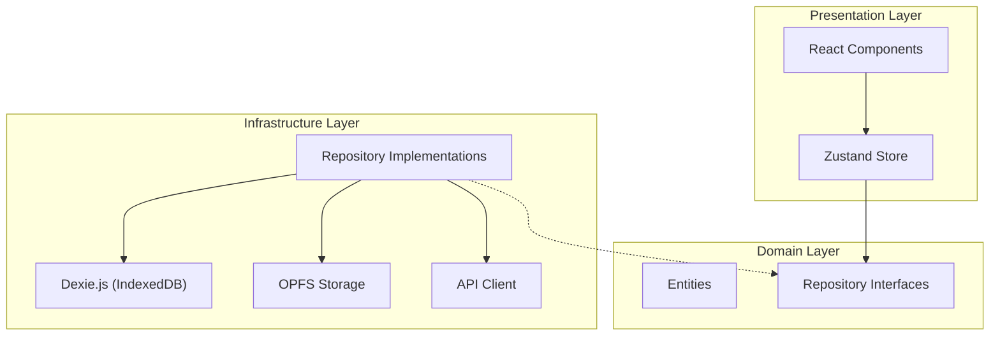

# 【React/TypeScript】完全オフライン動作する「Local-First」な点検アプリのアーキテクチャ設計

## はじめに

「地下の倉庫で電波が繋がらない」「山間部の現場で写真をアップロードできない」
現場 DX の文脈において、ネットワーク接続の不安定さは UX を破壊する最大の要因です。

従来の SPA（Single Page Application）は、API サーバーとの通信を前提としていました。Service Worker によるキャッシュである程度のオフライン対応は可能ですが、動的なデータの生成や保存（例：点検結果の入力、写真撮影）となると、単なるキャッシュでは対応しきれません。

そこで私たちが採用したのが **Local-First (Offline-First)** アーキテクチャです。
本記事では、**IndexedDB** と **OPFS (Origin Private File System)** を駆使し、**Clean Architecture** と **DDD (Domain-Driven Design)** の原則に基づいて構築した、堅牢なフロントエンド設計の詳細を解説します。

---

## 1. Local-First アーキテクチャの核心

Local-First とは、**「ローカルデバイス（ブラウザ）を信頼できる唯一の情報源（Source of Truth）とし、サーバーはあくまでバックアップや共有のために使う」** というパラダイムシフトです。

### 従来の Web アプリ vs Local-First

| 特徴                | 従来の Web アプリ            | Local-First アプリ              |
| ------------------- | ---------------------------- | ------------------------------- |
| **Source of Truth** | サーバー DB                  | **ローカル DB (IndexedDB)**     |
| **データ保存**      | API リクエスト (非同期)      | ローカル DB への書き込み (即時) |
| **ID 採番**         | サーバー (Auto Increment 等) | **クライアント (UUID v4)**      |
| **オフライン**      | エラーまたは Read-Only       | **Full Read/Write 可能**        |
| **レイテンシ**      | ネットワーク依存             | **ゼロ (ディスク I/O のみ)**    |

このアーキテクチャにより、ユーザーはネットワークの状態を一切気にすることなく、サクサクと作業を進めることができます。

---

## 2. 技術スタックと選定理由

- **Framework**: React 19 + TypeScript
- **Local DB**: **IndexedDB** (via **Dexie.js**)
  - _理由_: ブラウザ標準の NoSQL DB。`localStorage` (5MB 制限) とは比較にならない容量とクエリ能力を持つ。Dexie.js によるラッパーで型安全かつ直感的に扱える。
- **File Storage**: **OPFS (Origin Private File System)**
  - _理由_: 画像・動画などのバイナリデータを IndexedDB に入れるとパフォーマンスが劣化するため。ファイルシステムレベルの高速アクセスが可能。
- **State Management**: **Zustand**
  - _理由_: Redux より軽量でボイラープレートが少ない。非同期処理との相性が良く、ローカル DB との同期が書きやすい。
- **Architecture**: **Clean Architecture + DDD**
  - _理由_: 「データの保存先がローカルかサーバーか」という詳細をドメインロジックから隠蔽するため。

---

## 3. アーキテクチャ詳細：Clean Architecture の適用

フロントエンド内で Clean Architecture を適用し、依存の方向を制御しています。



### Domain Layer (中心)

ここにはビジネスロジックと型定義のみが存在します。外部ライブラリやフレームワークには依存しません。

```typescript
// src/domain/repositories/MobileInspectionRepository.ts
export interface IMobileInspectionRepository {
  saveEvidence(evidence: Evidence, file: Blob): Promise<void>
  getEvidencesByResultId(resultId: string): Promise<Evidence[]>
}
```

### Infrastructure Layer (詳細)

ここで初めて「データがどこに保存されるか」に関心を持ちます。
Local-First の肝は、**Repository の実装がまずローカル DB を読み書きする**点にあります。

```typescript
// src/infrastructure/repositories/MobileInspectionRepositoryImpl.ts
export class MobileInspectionRepositoryImpl implements IMobileInspectionRepository {
  async saveEvidence(evidence: Evidence, file: Blob): Promise<void> {
    // 1. バイナリはOPFSに保存 (高速)
    await this.opfs.saveFile(evidence.filePath, file)

    // 2. メタデータはIndexedDBに保存 (検索可能)
    await this.db.evidences.add({ ...evidence, sync_status: "pending" })
  }
}
```

---

## 4. OPFS (Origin Private File System) の活用

今回の技術的なハイライトの一つが **OPFS** です。
従来の Web アプリでは、画像を扱う際に以下の問題がありました：

1. **IndexedDB に Blob を入れる**: 読み書きが遅く、ブラウザ全体のパフォーマンスを低下させる。
2. **Base64 エンコード**: データサイズが約 1.3 倍になり、メモリ効率が悪い。

OPFS は、オリジンごとに隔離されたプライベートなファイルシステムを提供し、これらの問題を解決します。

### OPFS の実装例

```typescript
// src/infrastructure/storage/opfs.ts
async saveFile(path: string, blob: Blob): Promise<void> {
  const root = await navigator.storage.getDirectory()
  // ...ディレクトリ作成ロジック...
  const fileHandle = await dir.getFileHandle(fileName, { create: true })
  const writable = await fileHandle.createWritable()
  await writable.write(blob)
  await writable.close()
}
```

**ポイント**:

- **IndexedDB との連携**: IndexedDB には「ファイルパス」のみを保存し、実体は OPFS に置くことで、DB の軽量化と検索性を両立しています。

---

## 5. 実装パターン：Local-First を支える 5 つの柱

ここからは、Local-First アーキテクチャを実現するための具体的な実装パターンを紹介します。

### パターン 1: クライアントサイド ID 生成

オフラインでデータを作成するには、サーバーに問い合わせずに一意な ID が必要です。
**UUID v4** を採用することで、衝突リスクを回避しながらリレーションシップをローカルで構築できます。

```typescript
import { v4 as uuidv4 } from "uuid"

const newInspection = {
  id: uuidv4(), // クライアントで生成
  title: "定期点検",
  createdAt: Date.now(),
}
```

### パターン 2: 楽観的更新 + 同期キュー

ユーザーを待たせないために、**「まずローカルに保存し、バックグラウンドで同期する」** 戦略をとります。

```typescript
async saveResult(result: InspectionResult): Promise<void> {
  // 1. 即座にローカルDB保存（楽観的更新）
  await db.results.add(result)

  // 2. 同期キューに追加
  await syncQueue.enqueue('result', result.id, result)

  // UI更新は即座（<10ms）、サーバー同期は非同期
}
```

同期キュー自体も IndexedDB に永続化することで、アプリがクラッシュしたり再起動したりしても、未同期データが失われることはありません。

### パターン 3: オフライン時の認証継続

JWT の有効期限が切れた際、オフラインだとリフレッシュトークンによる更新が失敗します。
ここで安易にログアウトさせると、オフライン作業中のユーザーを締め出してしまいます。

**解決策**: ネットワークエラーによる更新失敗時は、**ログアウトせずにオフライン利用を継続**させます。

```typescript
try {
  await refreshToken()
} catch (e) {
  if (isNetworkError(e)) return // オフライン利用継続
  logout() // サーバーから拒否された場合のみログアウト
}
```

### パターン 4: 差分同期 (Incremental Sync)

マスターデータ（エリアや設備情報）を毎回全件取得するのは非効率です。
**タイムスタンプベースの差分同期** を実装することで、通信量を劇的に削減しました。

```typescript
// フロントエンド
const lastSyncAt = await db.settings.get("last_master_sync_at")
const url = lastSyncAt ? `/api/areas?since=${lastSyncAt}` : `/api/areas`

const areas = await fetch(url).then((r) => r.json())

// 初回: 全置換、2回目以降: マージ
if (lastSyncAt) {
  await db.areas.bulkPut(areas) // マージ
} else {
  await db.areas.clear()
  await db.areas.bulkAdd(areas) // 全置換
}
```

### パターン 5: 同期進捗の可視化

大量のデータ（特に写真や動画）を同期する際、ユーザーに安心感を与えるために進捗を可視化します。
Zustand で進捗状態を管理し、UI にプログレスバーを表示します。

```tsx
{
  isSyncing && (
    <div>
      <ProgressBar value={(progress.current / progress.total) * 100} />
      <p>
        {progress.current} / {progress.total} 件同期中...
      </p>
    </div>
  )
}
```

---

## 6. 競合解決戦略：CRDT を使わない選択

Local-First の文脈では **CRDT (Conflict-free Replicated Data Types)** がよく話題になりますが、本アプリでは採用しませんでした。

**理由**:

1. **単一ユーザー・単一デバイス**: 点検員は 1 台の端末で作業するため、リアルタイムな同時編集が発生しない。
2. **Append-Only**: 点検結果は「上書き」ではなく「追記」のみ許可する設計にしたため、競合自体が発生しない。
3. **LWW (Last-Write-Wins)**: タスクのステータスなど単純な値は、タイムスタンプによる後勝ちで十分。

**学び**: CRDT は強力ですが、すべての Local-First アプリに必須ではありません。ユースケースに応じて、よりシンプルな戦略（Append-Only など）を選ぶことが重要です。

---

## 7. まとめ：Local-First がもたらす UX 変革

### 実装成果

このアーキテクチャを採用したことで、以下の成果が得られました：

1.  **UX の劇的な向上**: UI 反応速度が **<10ms** になり、ネットワーク待ち時間がゼロになりました。
2.  **堅牢性**: 「電波が悪いから使えない」という現場のボトルネックを解消しました。
3.  **効率性**: 差分同期により、データ転送量を **95%以上削減** しました。

### Local-First アーキテクチャ成熟度: 90/100

| カテゴリ     | スコア | 状態                                  |
| ------------ | ------ | ------------------------------------- |
| **コア機能** | 10/10  | ✅ IndexedDB + OPFS で完全対応        |
| **同期機能** | 10/10  | ✅ 永続化キュー、差分同期、進捗可視化 |
| **認証**     | 10/10  | ✅ オフライン継続ロジック             |
| **運用**     | 5/10   | ⚠️ S3 連携、監視等はこれから          |

Local-First は、単なるオフライン対応ではありません。**「ネットワークは不安定である」という前提に立った、現代の Web アプリケーションのあるべき姿**の一つだと考えています。

現場 DX や、信頼性が求められる業務アプリを開発されている方の参考になれば幸いです。

**GitHub**: [リポジトリ URL]  
**技術スタック**: React 19, TypeScript, IndexedDB (Dexie.js), OPFS, Zustand, Spring Boot, Kotlin
