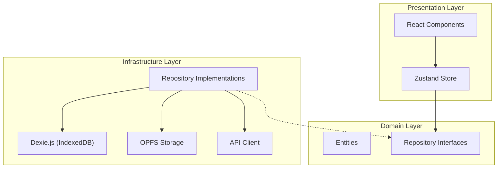

# 【React/TypeScript】完全オフライン動作する「Local-First」な点検アプリのアーキテクチャ設計

## はじめに

「地下の倉庫で電波が繋がらない」「山間部の現場で写真をアップロードできない」
現場 DX の文脈において、ネットワーク接続の不安定さは UX を破壊する最大の要因です。

従来の SPA（Single Page Application）は、API サーバーとの通信を前提としていました。Service Worker によるキャッシュである程度のオフライン対応は可能ですが、動的なデータの生成や保存（例：点検結果の入力、写真撮影）となると、単なるキャッシュでは対応しきれません。

そこで私たちが採用したのが **Local-First (Offline-First)** アーキテクチャです。
本記事では、**IndexedDB** と **OPFS (Origin Private File System)** を駆使し、**Clean Architecture** と **DDD (Domain-Driven Design)** の原則に基づいて構築した、堅牢なフロントエンド設計の詳細を解説します。

---

## 1. Local-First アーキテクチャの核心

Local-First とは、**「ローカルデバイス（ブラウザ）を信頼できる唯一の情報源（Source of Truth）とし、サーバーはあくまでバックアップや共有のために使う」** というパラダイムシフトです。

### 従来の Web アプリ vs Local-First

| 特徴                | 従来の Web アプリ            | Local-First アプリ              |
| ------------------- | ---------------------------- | ------------------------------- |
| **Source of Truth** | サーバー DB                  | **ローカル DB (IndexedDB)**     |
| **データ保存**      | API リクエスト (非同期)      | ローカル DB への書き込み (即時) |
| **ID 採番**         | サーバー (Auto Increment 等) | **クライアント (UUID v4)**      |
| **オフライン**      | エラーまたは Read-Only       | **Full Read/Write 可能**        |
| **レイテンシ**      | ネットワーク依存             | **ゼロ (ディスク I/O のみ)**    |

このアーキテクチャにより、ユーザーはネットワークの状態を一切気にすることなく、サクサクと作業を進めることができます。

---

## 2. 技術スタックと選定理由

- **Framework**: React 19 + TypeScript
- **Local DB**: **IndexedDB** (via **Dexie.js**)
  - _理由_: ブラウザ標準の NoSQL DB。`localStorage` (5MB 制限) とは比較にならない容量とクエリ能力を持つ。Dexie.js によるラッパーで型安全かつ直感的に扱える。
- **File Storage**: **OPFS (Origin Private File System)**
  - _理由_: 画像・動画などのバイナリデータを IndexedDB に入れるとパフォーマンスが劣化するため。ファイルシステムレベルの高速アクセスが可能。
- **State Management**: **Zustand**
  - _理由_: Redux より軽量でボイラープレートが少ない。非同期処理との相性が良く、ローカル DB との同期が書きやすい。
- **Architecture**: **Clean Architecture + DDD**
  - _理由_: 「データの保存先がローカルかサーバーか」という詳細をドメインロジックから隠蔽するため。

---

## 3. アーキテクチャ詳細：Clean Architecture の適用

フロントエンド内で Clean Architecture を適用し、依存の方向を制御しています。



### Domain Layer (中心)

ここにはビジネスロジックと型定義のみが存在します。外部ライブラリやフレームワークには依存しません。

```typescript
// src/domain/entities/Evidence.ts
export class Evidence {
  constructor(
    public readonly id: string,
    public readonly resultId: string,
    public readonly type: "image" | "video",
    public readonly filePath: string, // OPFS上のパス
    public readonly mimeType: string,
    public readonly createdAt: number
  ) {}
}

// src/domain/repositories/IInspectionRepository.ts
export interface IInspectionRepository {
  saveEvidence(evidence: Evidence, file: Blob): Promise<void>
  getEvidencesByResultId(resultId: string): Promise<Evidence[]>
}
```

### Infrastructure Layer (詳細)

ここで初めて「データがどこに保存されるか」に関心を持ちます。
Local-First の肝は、**Repository の実装がまずローカル DB を読み書きする**点にあります。

```typescript
// src/infrastructure/repositories/InspectionRepositoryImpl.ts
export class InspectionRepositoryImpl implements IInspectionRepository {
  constructor(
    private db: LocalBridgeDatabase, // Dexieインスタンス
    private opfs: OPFSStorage // OPFSラッパー
  ) {}

  async saveEvidence(evidence: Evidence, file: Blob): Promise<void> {
    // 1. バイナリはOPFSに保存 (高速)
    await this.opfs.saveFile(evidence.filePath, file)

    // 2. メタデータはIndexedDBに保存 (検索可能)
    await this.db.evidences.add({
      id: evidence.id,
      resultId: evidence.resultId,
      filePath: evidence.filePath,
      mimeType: evidence.mimeType,
      createdAt: evidence.createdAt,
      sync_status: "pending", // 未同期フラグ
    })
  }
}
```

---

## 4. OPFS (Origin Private File System) の活用

今回の技術的なハイライトの一つが **OPFS** です。
従来の Web アプリでは、画像を扱う際に以下の問題がありました：

1. **IndexedDB に Blob を入れる**: 読み書きが遅く、ブラウザ全体のパフォーマンスを低下させる。
2. **Base64 エンコード**: データサイズが約 1.3 倍になり、メモリ効率が悪い。

OPFS は、オリジンごとに隔離されたプライベートなファイルシステムを提供し、これらの問題を解決します。

### OPFS の実装例

```typescript
// src/infrastructure/storage/opfs.ts
export class OPFSStorage {
  private rootPromise: Promise<FileSystemDirectoryHandle>

  constructor() {
    this.rootPromise = navigator.storage.getDirectory()
  }

  /**
   * ファイルを保存（ディレクトリも自動作成）
   */
  async saveFile(path: string, blob: Blob): Promise<void> {
    const root = await this.rootPromise

    // パスからディレクトリ階層を作成
    const parts = path.split("/")
    const fileName = parts.pop()!
    let currentDir = root

    for (const part of parts) {
      if (part) {
        currentDir = await currentDir.getDirectoryHandle(part, { create: true })
      }
    }

    // FileSystemWritableFileStreamを作成して書き込み
    const fileHandle = await currentDir.getFileHandle(fileName, { create: true })
    const writable = await fileHandle.createWritable()
    await writable.write(blob)
    await writable.close()
  }

  /**
   * Data URLとして取得（表示用）
   */
  async getDataURL(path: string): Promise<string> {
    const file = await this.getFile(path)
    return new Promise((resolve, reject) => {
      const reader = new FileReader()
      reader.onload = () => resolve(reader.result as string)
      reader.onerror = reject
      reader.readAsDataURL(file)
    })
  }
}
```

**ポイント**:

- **ディレクトリ構造**: 日付やカテゴリごとにフォルダを分けることが可能（例: `evidence/2023-10/task-123/image.jpg`）。
- **Data URL 変換**: UI で表示する際は、必要なタイミングで Data URL に変換して表示します（`useOPFSFile` カスタムフックで管理）。
- **IndexedDB との連携**: IndexedDB には「ファイルパス」のみを保存し、実体は OPFS に置くことで、DB の軽量化と検索性を両立しています。

---

## 5. 再検査ワークフローの実装

設備点検において重要なのが「NG だった項目の再検査」です。
本アプリでは、以下のフローで再検査を実現しています。

1. **検査完了**: すべての項目をチェックし、ステータスを `Done` にする。
2. **NG 抽出**: `Done` になった検査の中に `NG` 判定の項目がある場合、「再検査を作成」ボタンが有効化される。
3. **新規作成**: ボタンを押すと、**NG 項目のみをコピーした新しい検査データ** が作成される（UUID を新規採番）。
4. **履歴保持**: 元の検査データは変更されず、履歴として残る。

```typescript
// src/infrastructure/services/ReInspectionService.ts
async createReInspection(originalId: string): Promise<string> {
  // 1. 元の検査と項目を取得
  const original = await db.inspections.get(originalId)
  const items = await db.inspectionItems.where('inspectionId').equals(originalId).toArray()

  // 2. NG項目のみフィルタリング
  const ngItems = await this.filterNGItems(items)

  // 3. 新しい検査を作成
  const newId = uuidv4()
  await db.inspections.add({
    id: newId,
    title: `Re-inspection: ${original.title}`,
    status: 'todo',
    // ...
  })

  // 4. NG項目をコピー
  for (const item of ngItems) {
    await db.inspectionItems.add({
      id: uuidv4(),
      inspectionId: newId,
      // ...
    })
  }

  return newId
}
```

この設計により、「過去の点検結果を改ざんすることなく、不具合箇所の是正確認を行う」という業務要件を満たしています。

---

## 6. 同期ロジックと競合解決

Local-First における最大の課題は「同期」と「競合解決」です。
私たちは **「手動同期」** と **「データ特性に応じた競合解決戦略」** を採用しました。

### 2.3 クライアントサイド ID 生成 (Client-side ID Generation)

オフラインファーストを実現するためには、**ID の発行をサーバーに依存してはいけません**。
オフライン状態で新しいデータ（検査結果やコメントなど）を作成した際、即座に一意な ID が必要です。

Local Bridge では、以下の戦略を採用しています：

- **UUID v4 の採用**: すべてのエンティティの主キーには UUID (v4) を使用します。
- **フロントエンドでの生成**: データの作成時に、ブラウザ（JavaScript）側で `uuid` ライブラリを使用して ID を生成します。
- **衝突の回避**: UUID v4 の衝突確率は極めて低いため、実用上の問題はありません。

これにより、サーバーとの通信を待たずに、リレーションシップ（例：検査結果とエビデンスの紐付け）を持つデータをローカルで完結して作成できます。

### 2.4 データの同期 (Synchronization)

`SyncService` クラスが双方向の同期を管理します。

#### 1. マスターデータ同期 (Server → Client)

- 同期時にサーバーから全件取得し、ローカルの IndexedDB を洗い替え（Clear & BulkAdd）します。

#### 2. トランザクションデータ同期 (Client ⇄ Server)

- **Upstream (Client → Server)**:

  - ローカルで作成・更新されたデータ（Inspection, InspectionItem, Result, Comment, Evidence）をサーバーへ送信します。
  - `fetch` API を使用して JSON 形式で POST します。
  - Evidence（画像）は、メタデータを送信した後、S3 へのアップロード処理を行います（Presigned URL 利用）。

- **Downstream (Server → Client)**:
  - サーバー側で更新されたデータ（他のユーザーによる実施結果など）を取得し、ローカル DB にマージします。

### UI は「常に」IndexedDB を見る

このアーキテクチャの重要なポイントは、**UI コンポーネントが API を直接叩かない**ことです。

- **Read**: 常に IndexedDB からデータを取得して表示します（`useLiveQuery`などでリアクティブに反映）。
- **Write**: IndexedDB に書き込みます。

これにより、ユーザーは「サーバーからのレスポンス待ち」を経験することがありません。API 通信はすべてバックグラウンド（同期プロセス）で行われ、UI スレッドをブロックしないため、**体感速度は爆速**になります。

### コラム：なぜ「手動同期」なのか？

技術的には `navigator.onLine` や `window.addEventListener('online')` を使用して、ネットワーク復帰時に自動で同期を開始することも可能です。

しかし、現場のネットワーク環境は「繋がっているけど極端に遅い」「頻繁に切れる」といった不安定な状況が多々あります。
そのような環境で自動同期が走ると：

- バッテリーを激しく消耗する
- 中途半端に失敗してデータ整合性が心配になる
- ユーザーが「今保存された？」と不安になる

といった UX 上の問題が発生します。そのため、今回は**ユーザーにコントロール権を委ねる（明示的に同期ボタンを押してもらう）** 設計を採用しました。
もちろん、要件によっては自動同期を採用することも可能です。また、**Push 通知**（無料の Web Push API）を利用して、新しいタスクがアサインされた際にユーザーに同期を促すことも計画しています。

### 競合解決戦略

複数人が同じタスクを操作した場合の競合をどう防ぐか？
私たちは「技術的なマージ」ではなく「業務的な設計」で解決しました。

#### 1. InspectionResult: Append-Only (追記のみ)

点検結果は「上書き」を禁止しました。
A さんが「OK」、B さんが「NG」と判定した場合、**両方のレコードを保存**します。

```typescript
// サーバー上のデータ構造イメージ
{
  taskId: "task-123",
  history: [
    { user: "UserA", verdict: "OK", timestamp: 1000 },
    { user: "UserB", verdict: "NG", timestamp: 1005 } // ← 最新
  ]
}
```

これにより、**「競合」という概念自体をなくし**、監査証跡としての価値を高めました。

#### 2. Task Status: Last-Write-Wins (LWW)

タスクのステータス（完了/未完了）など、単一の値しか持てないものは、**タイムスタンプによる後勝ち**を採用しました。

```typescript
if (serverTask.updatedAt > localTask.updatedAt) {
  // サーバーが新しい -> ローカルを更新
  await db.tasks.put(serverTask)
} else {
  // ローカルが新しい -> サーバーへ送信
  await api.updateTask(localTask)
}
```

---

## 7. バックエンドの役割：実は「普通の REST API」でいい

Local-First アーキテクチャの隠れたメリットは、**バックエンドがシンプルになること**です。

### バックエンドが知らなくて良いこと

今回の設計では、バックエンドは以下のことを一切意識していません：

- クライアントが現在オンラインかオフラインか
- クライアントがいつ同期を実行したか
- どのデータが未同期か

### 責務の分離

| 責務               | 担当       | 理由                                                                 |
| ------------------ | ---------- | -------------------------------------------------------------------- |
| **同期タイミング** | **Client** | 通信環境を知っているのはクライアントだけだから                       |
| **競合解決**       | **Client** | ユーザーの意図（どれを残すか）を確認できるのはクライアントだけだから |
| **データの永続化** | **Server** | 最終的な「真実（Source of Truth）」としてデータを守るため            |

結果として、バックエンドは **Spring Boot で作られたごく一般的な REST API** となりました。
特別な同期プロトコルや WebSocket などは使用せず、シンプルな CRUD エンドポイントを提供するだけで、この高度なオフライン機能を実現します。

---

## 8. なぜネイティブアプリではなく PWA なのか？

Local-First なアプリを作るなら、iOS/Android のネイティブアプリで作るのが王道かもしれません。しかし、私たちはあえて **PWA (Progressive Web Apps)** を採用しました。

### Local-First × PWA の相乗効果

1.  **アセットのオフライン化 (Service Worker)**

    - Local-First でデータがローカルにあっても、アプリ自体（HTML/JS）が起動しなければ意味がありません。
    - PWA の Service Worker を使ってアセットをキャッシュすることで、**機内モードでもアプリが立ち上がる**状態を作れます。

2.  **インストールのハードルが低い（外部業者との連携）**

    - 今回のユースケースである「点検業務」は、社内だけでなく**外部の協力会社**に依頼することも多々あります。
    - 外部業者の端末に専用アプリをインストールしてもらうのは、セキュリティポリシーや MDM（端末管理）の観点からハードルが高い場合があります。
    - PWA なら、**URL を共有するだけ**で即座に業務を開始でき、BYOD（私物端末の利用）や OS の違い（iOS/Android）も気にする必要がありません。

3.  **クロスプラットフォーム**
    - Web 技術（React）だけで、PC（管理者）、タブレット（点検者）、スマホ（確認用）のすべてに対応できます。
    - OPFS や IndexedDB といった Web 標準技術が成熟してきたことで、Web でもネイティブ並みのファイル操作が可能になりました。

---

## 9. まとめ：Local-First がもたらす UX 変革

このアーキテクチャを採用したことで、以下の成果が得られました：

1.  **UX の劇的な向上**: ネットワーク待ち時間がゼロになり、アプリの応答性が飛躍的に向上しました。
2.  **堅牢性**: 「電波が悪いから使えない」という現場の言い訳（ボトルネック）を解消しました。
3.  **開発者体験**: サーバーの状態管理から解放され、ローカル DB に対するシンプルな CRUD に集中できるようになりました。

Local-First は、単なるオフライン対応ではありません。**「ネットワークは不安定である」という前提に立った、現代の Web アプリケーションのあるべき姿**の一つだと考えています。

現場 DX や、信頼性が求められる業務アプリを開発されている方の参考になれば幸いです。
