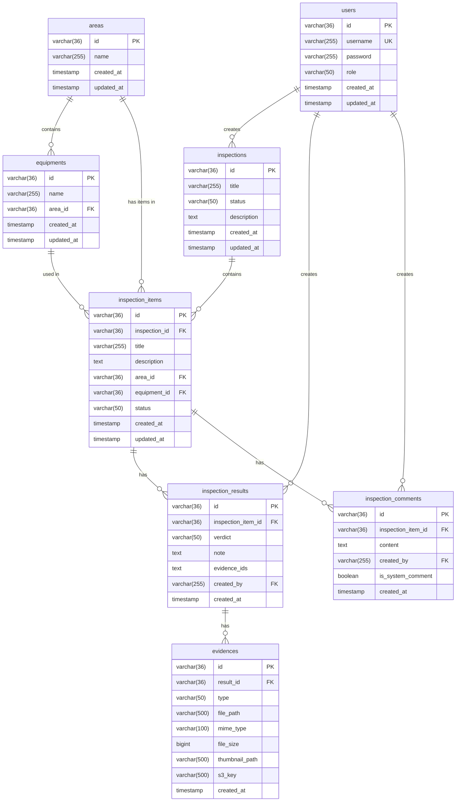

# データベース ER 図

## 概要

Local Bridge アプリケーションのデータベーススキーマを示す ER 図です。

## ER 図

## テーブル説明

### users

ユーザー情報を管理するテーブル。

### areas

検査対象のエリア（例: Kitchen, Hall）を管理。

### equipments

各エリア内の設備（例: Dishwasher, Oven）を管理。

### inspections

検査の親エンティティ。1 回の点検業務を表す（例: "Monthly Facility Check"）。

### inspection_items

検査項目。各検査に含まれる個別のチェック項目（例: "Check Dishwasher"）。

### inspection_results

検査結果。各検査項目に対する実施結果（OK/NG/N/A）。

### inspection_comments

検査項目に対するコメント。レビュアーのフィードバックやシステムログを含む。

### evidences

検査結果に紐づく証拠（写真・動画）のメタデータ。
実際のファイルは OPFS（フロントエンド）または S3（バックエンド）に保存。

## ステータス定義

### InspectionStatus / InspectionItemStatus

- `TODO`: 未着手
- `IN_REVIEW`: レビュー待ち（検査実施済み）
- `DONE`: 完了（承認済み）
- `CORRECTION_NEEDED`: 再検査が必要

### InspectionVerdict

- `OK`: 合格
- `NG`: 不合格
- `N_A`: 該当なし

### EvidenceType

- `IMAGE`: 画像
- `VIDEO`: 動画

## インデックス

パフォーマンス向上のため、以下のインデックスを設定：

- `equipments.area_id`
- `inspection_items.inspection_id`
- `inspection_items.area_id`
- `inspection_items.equipment_id`
- `inspection_results.inspection_item_id`
- `inspection_comments.inspection_item_id`
- `evidences.result_id`

## 外部キー制約

- `ON DELETE CASCADE`: 親レコード削除時に子レコードも自動削除
  - `inspections` → `inspection_items`
  - `inspection_items` → `inspection_results`, `inspection_comments`
  - `inspection_results` → `evidences`
  - `areas` → `equipments`

## 更新履歴

| Version | Date       | Description          |
| ------- | ---------- | -------------------- |
| V1      | 2025-11-XX | ユーザーテーブル作成 |
| V2      | 2025-11-26 | 検査関連テーブル作成 |
