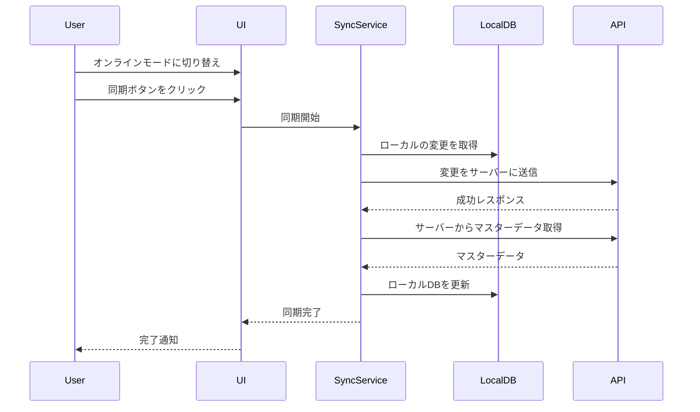
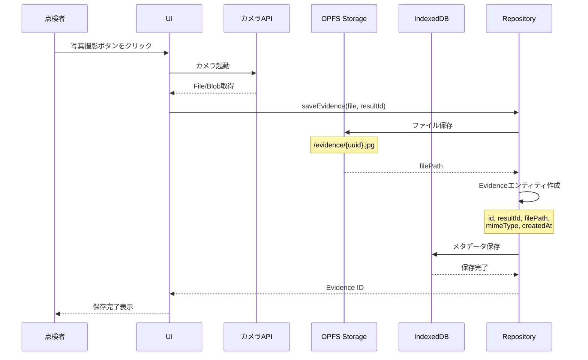
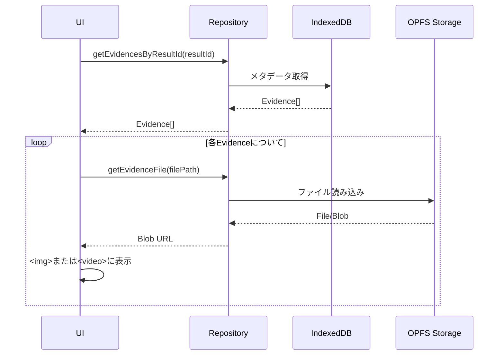
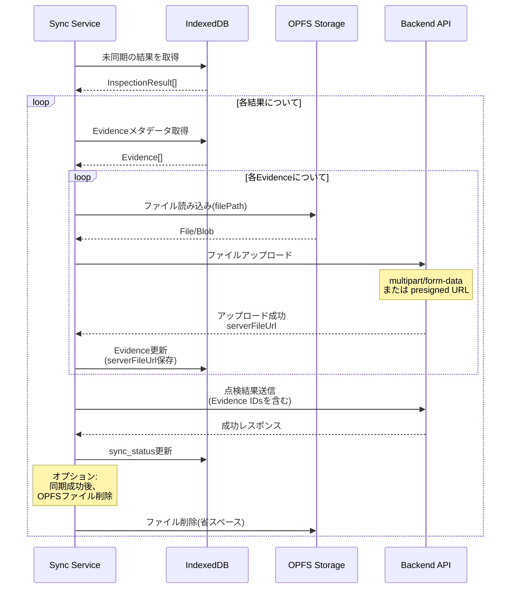

# Frontend Architecture (React + TypeScript)

**Clean Architecture** に基づき、関心事を分離して実装します。
依存の方向は常に **外側(詳細)から内側(抽象)** へ向かいます。

## Layer Structure

```mermaid
graph TD
    Presentation[Presentation Layer<br/>(React, Zustand)] --> Application[Application Layer<br/>(Use Cases)]
    Application --> Domain[Domain Layer<br/>(Entities, Repository Interfaces)]
    Infrastructure[Infrastructure Layer<br/>(Dexie, IndexedDB, API)] --> Domain
    Infrastructure -.->|Implements| Domain
```

### 1. Domain Layer (`src/domain`)

- **役割**: ビジネスロジックの中核。フレームワークや外部ライブラリに依存しない純粋な TypeScript で記述。
- **構成要素**:
  - **Entities**: 一意な識別子を持つドメインオブジェクト
    - `Area` - 点検エリア
    - `Equipment` - 設備
    - `InspectionTask` - 点検タスク
    - `InspectionResult` - 点検結果
    - `InspectionComment` - コメント
    - `Evidence` - エビデンス(写真・動画)
  - **Value Objects**: 値によって識別されるオブジェクト(例: `InspectionStatus`, `InspectionVerdict`)
  - **Repository Interfaces**: データの永続化に関する抽象定義
    - `IInspectionRepository` - 点検関連データの操作
    - `IAuthRepository` - 認証関連データの操作

### 2. Application Layer (`src/application`)

- **役割**: ドメインオブジェクトを操作し、ユースケースを実現する。
- **構成要素**:
  - **Use Cases**: アプリケーションの機能単位(例: `CreateTaskUseCase`, `SubmitResultUseCase`)
  - **Services**: ドメインを跨ぐロジック(必要な場合)

### 3. Infrastructure Layer (`src/infrastructure`)

- **役割**: 技術的な詳細の実装。
- **構成要素**:
  - **Repositories**: Domain層で定義されたインターフェースの実装
    - `InspectionRepositoryImpl` - IndexedDB(Dexie)を使用した実装
    - `AuthRepositoryImpl` - 認証APIクライアントを使用した実装
  - **External Services**:
    - API クライアント(`src/infrastructure/api/client.ts`)
    - IndexedDB (Dexie) (`src/infrastructure/db.ts`)
  - **Database**: Dexieを使用したIndexedDBの定義とマイグレーション

### 4. Presentation Layer (`src/presentation`)

- **役割**: ユーザーインターフェースと状態管理。
- **構成要素**:
  - **Pages**: ルーティングに対応するページコンポーネント
    - `auth/*` - 認証関連ページ(login, register)
    - `desktop/*` - デスクトップ向けページ(管理者用)
    - `mobile/*` - モバイル向けページ(点検者用)
  - **Features**: ページで使用される機能コンポーネント
  - **Components**: 再利用可能なUIコンポーネント
  - **Stores**: Zustand によるグローバル状態管理。Use Case を呼び出し、結果を Store に反映する。
  - **Hooks**: UI ロジックの切り出し。

## Data Flow & Synchronization Strategy

### オフラインファースト設計

このアプリケーションは**オフラインファースト**で設計されています。

1. **ローカルデータベース**: IndexedDB(Dexie)を使用
2. **オンライン/オフラインモード**: ユーザーが手動で切り替え
   - 不安定な接続での自動同期を避けるため、明示的な切り替えを採用
3. **同期タイミング**: ユーザーが同期ボタンを押した時のみ実行

### 同期フロー



### データの種類と同期方向

| データ種類        | 同期方向        | 説明                                 |
| ----------------- | --------------- | ------------------------------------ |
| Area, Equipment   | Server → Client | マスターデータ。サーバーから取得のみ |
| InspectionTask    | Server → Client | 管理者が作成したタスク               |
| InspectionResult  | Client → Server | 点検者が登録した結果                 |
| InspectionComment | Bi-directional  | コメントは双方向同期                 |
| Evidence          | Client → Server | 写真・動画はクライアントから送信     |

## Evidence (エビデンス) 管理とOPFS

### なぜOPFSを使用するのか

点検業務では、写真や動画などの大容量バイナリファイルを扱います。これらをIndexedDBに保存すると以下の問題が発生します:

- **パフォーマンス低下**: Base64エンコードのオーバーヘッド、大きなオブジェクトの読み書きでメインスレッドがブロック
- **容量制限**: IndexedDBの容量制限に早く到達
- **メモリ消費**: 大きなBlobをメモリに展開する必要がある

**OPFS (Origin Private File System)** を使用することで:

- ✅ ファイルシステムレベルの高速I/O
- ✅ メインスレッドをブロックしない
- ✅ より大きな容量を扱える
- ✅ ストリーミング処理が可能

### Evidenceのデータ構造

```typescript
// Domain Entity
class Evidence {
  id: string // UUID
  resultId: string // 紐づく点検結果のID
  type: 'image' | 'video'
  filePath: string // OPFSでのファイルパス (例: '/evidence/550e8400-e29b-41d4.jpg')
  mimeType: string // 'image/jpeg', 'video/mp4'等
  createdAt: number
  fileSize?: number // ファイルサイズ(bytes)
  thumbnailPath?: string // サムネイルのパス(オプション)
}
```

**設計のポイント**:

- メタデータ(id, type, mimeType等)はIndexedDBに保存
- 実ファイルはOPFSに保存し、`filePath`で参照
- Base64エンコードは使用しない

### エビデンス登録のデータフロー



### エビデンス表示のデータフロー



### 同期時のデータフロー



### OPFSファイル管理戦略

#### ファイル命名規則

```
/evidence/{uuid}.{ext}
```

例:

- `/evidence/550e8400-e29b-41d4-a716-446655440000.jpg`
- `/evidence/6ba7b810-9dad-11d1-80b4-00c04fd430c8.mp4`

#### ディレクトリ構造

```
OPFS Root
└── evidence/
    ├── {uuid}.jpg
    ├── {uuid}.mp4
    ├── {uuid}.png
    └── thumbnails/  (オプション)
        ├── {uuid}_thumb.jpg
        └── {uuid}_thumb.jpg
```

#### ファイルライフサイクル

1. **作成**: カメラ撮影またはファイル選択時
2. **保存**: OPFS に即座に保存
3. **参照**: Evidence メタデータの `filePath` から取得
4. **同期**: サーバーにアップロード
5. **削除**:
   - オプション1: 同期成功後に削除(省スペース)
   - オプション2: 保持(オフライン時の再表示用)

### Infrastructure Layer実装

#### OPFSラッパー (`src/infrastructure/storage/opfs.ts`)

```typescript
export class OPFSStorage {
  private root: FileSystemDirectoryHandle | null = null

  async init(): Promise<void> {
    this.root = await navigator.storage.getDirectory()
  }

  async saveFile(filePath: string, blob: Blob): Promise<void> {
    // ファイル保存実装
  }

  async getFile(filePath: string): Promise<File> {
    // ファイル取得実装
  }

  async deleteFile(filePath: string): Promise<void> {
    // ファイル削除実装
  }

  async exists(filePath: string): Promise<boolean> {
    // ファイル存在確認
  }
}
```

#### Repository実装の更新

```typescript
export class InspectionRepositoryImpl implements IInspectionRepository {
  constructor(
    private db: LocalBridgeDatabase,
    private opfs: OPFSStorage
  ) {}

  async saveEvidence(file: File, resultId: string): Promise<string> {
    const id = uuidv4()
    const ext = file.name.split('.').pop()
    const filePath = `/evidence/${id}.${ext}`

    // OPFSに保存
    await this.opfs.saveFile(filePath, file)

    // メタデータをIndexedDBに保存
    const evidence = new Evidence(
      id,
      resultId,
      file.type.startsWith('video') ? 'video' : 'image',
      filePath,
      file.type,
      Date.now(),
      file.size
    )

    await this.db.evidences.add({ ...evidence })

    return id
  }

  async getEvidenceFile(filePath: string): Promise<File> {
    return await this.opfs.getFile(filePath)
  }
}
```

## Development Tools

### Database Seeding

開発時にテストデータを投入するためのスクリプトを用意しています。

```bash
npm run seed
```

**注意**: このスクリプトは開発用です。本番環境では実行されません。
