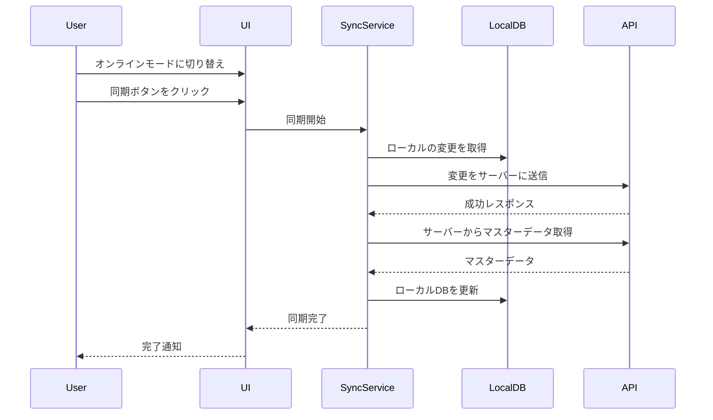
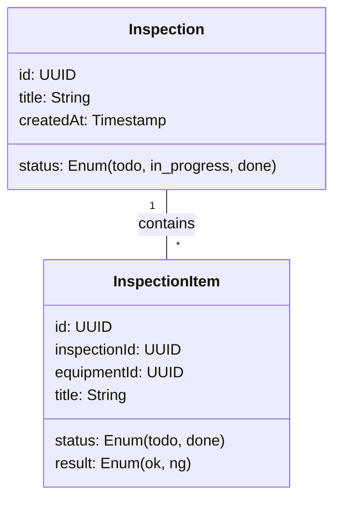
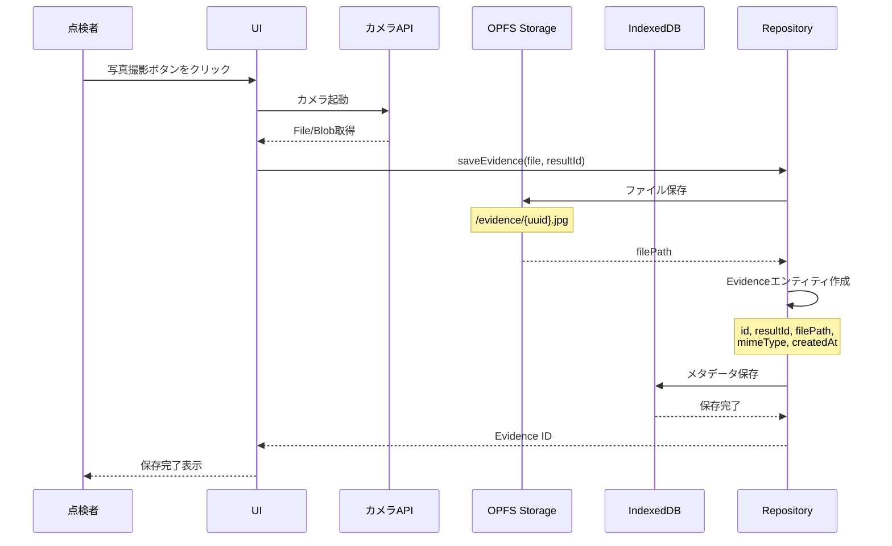
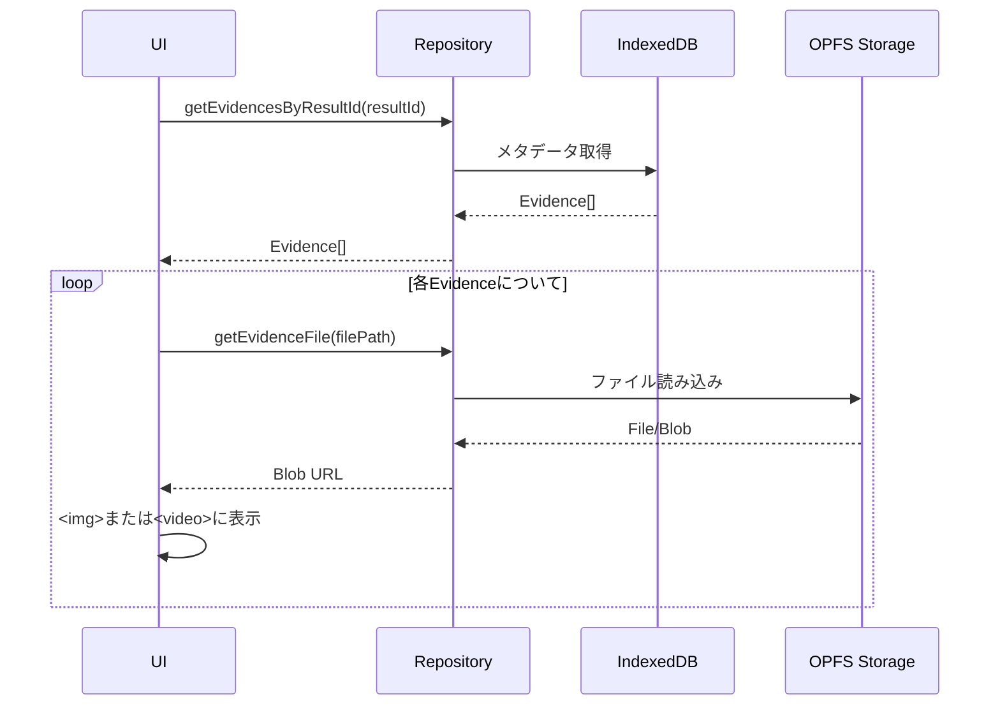
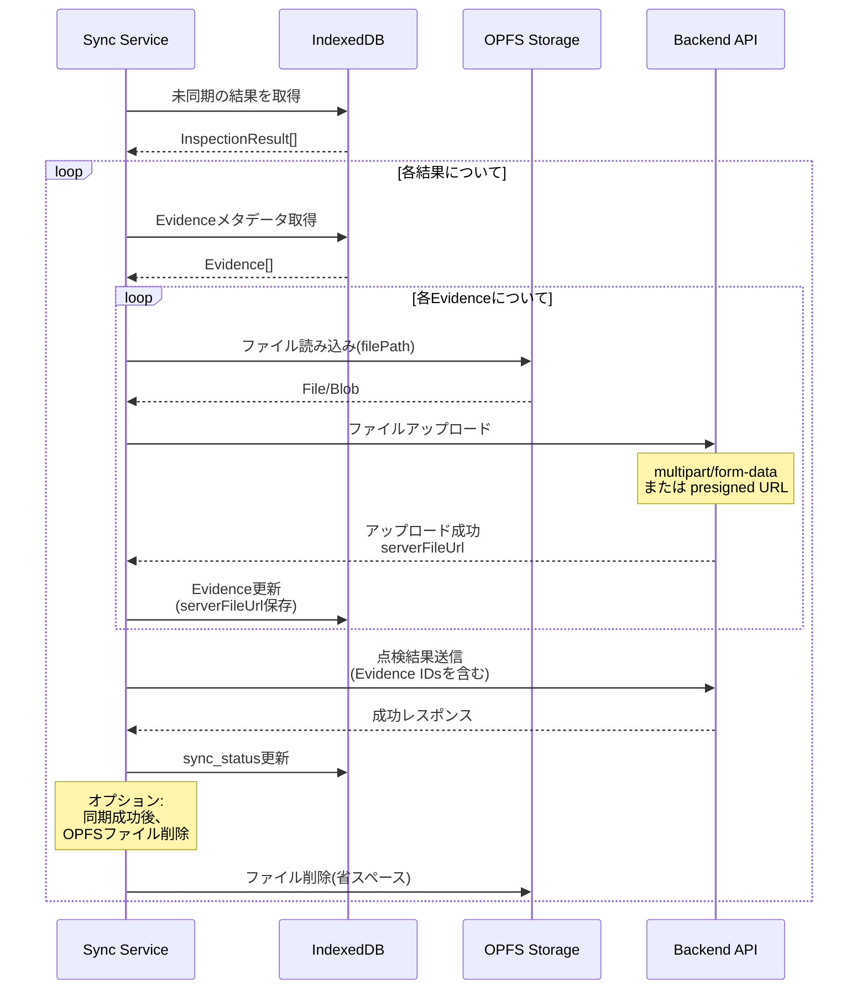

# Frontend Architecture (React + TypeScript)

**Clean Architecture** に基づき、関心事を分離して実装します。
依存の方向は常に **外側(詳細)から内側(抽象)** へ向かいます。

## Layer Structure

```mermaid
graph TD
    Presentation[Presentation Layer<br/>(React, Zustand)] --> Application[Application Layer<br/>(Use Cases)]
    Application --> Domain[Domain Layer<br/>(Entities, Repository Interfaces)]
    Infrastructure[Infrastructure Layer<br/>(Dexie, IndexedDB, API)] --> Domain
    Infrastructure -.->|Implements| Domain
```

### 1. Domain Layer (`src/domain`)

- **役割**: ビジネスロジックの中核。フレームワークや外部ライブラリに依存しない純粋な TypeScript で記述。
- **構成要素**:
  - **Entities**: 一意な識別子を持つドメインオブジェクト
    - `Area` - 点検エリア
    - `Equipment` - 設備
    - `InspectionTask` - 点検タスク
    - `InspectionResult` - 点検結果
    - `InspectionComment` - コメント
    - `Evidence` - エビデンス(写真・動画)
  - **Value Objects**: 値によって識別されるオブジェクト(例: `InspectionStatus`, `InspectionVerdict`)
  - **Repository Interfaces**: データの永続化に関する抽象定義
    - `IMobileInspectionRepository` - 点検関連データの操作（Mobile用、IndexedDB）
    - `IDesktopInspectionRepository` - 点検関連データの操作（Desktop用、API）
    - `IAuthRepository` - 認証関連データの操作

### 2. Application Layer (`src/application`)

- **役割**: ドメインオブジェクトを操作し、ユースケースを実現する。
- **構成要素**:
  - **Use Cases**: アプリケーションの機能単位(例: `CreateTaskUseCase`, `SubmitResultUseCase`)
  - **Services**: ドメインを跨ぐロジック(必要な場合)

### 3. Infrastructure Layer (`src/infrastructure`)

- **役割**: 技術的な詳細の実装。
- **構成要素**:
  - **Repositories**: Domain層で定義されたインターフェースの実装
    - `MobileInspectionRepositoryImpl` - IndexedDB(Dexie)を使用した実装（Mobile用、オフライン対応）
    - `DesktopInspectionRepositoryImpl` - API経由の実装（Desktop用、オンライン専用）
    - `AuthRepositoryImpl` - 認証APIクライアントを使用した実装
  - **Services**:
    - `SyncService` - 同期処理
    - `SyncQueueService` - 同期キュー管理
  - **External Services**:
    - API クライアント(`src/infrastructure/api/client.ts`)
    - IndexedDB (Dexie) (`src/infrastructure/db.ts`)
  - **Database**: Dexieを使用したIndexedDBの定義とマイグレーション

### 4. Presentation Layer (`src/presentation`)

- **役割**: ユーザーインターフェースと状態管理。
- **構成要素**:
  - **Pages**: ルーティングに対応するページコンポーネント
    - `auth/*` - 認証関連ページ(login, register)
    - `desktop/*` - デスクトップ向けページ(管理者用、オンライン専用)
    - `mobile/*` - モバイル向けページ(点検者用、オフライン対応)
  - **Features**: ページで使用される機能コンポーネント
  - **Components**: 再利用可能なUIコンポーネント
  - **Stores**: Zustand によるグローバル状態管理。Use Case を呼び出し、結果を Store に反映する。
  - **Hooks**: UI ロジックの切り出し。
    - `desktop/useDesktopInspection.ts` - Desktop用データ取得（API経由）
    - `mobile/useMobileInspection.ts` - Mobile用データ取得（IndexedDB経由）
    - `useSync.ts` - 同期機能（Mobile用）

## ID Generation Strategy

オフラインファーストを実現するため、**IDの発行はすべてクライアントサイド(フロントエンド)**で行います。

- **UUID v4**: すべてのエンティティのIDには UUID v4 を使用します。
- **生成タイミング**: データの作成時（`new InspectionResult()` など）に即座に生成します。
- **サーバーとの整合性**: サーバー側も UUID を主キーとして受け入れる設計になっています。

これにより、サーバー通信なしでリレーションシップを持つデータを作成・保存できます。

## Data Flow & Synchronization Strategy

### オフラインファースト設計

このアプリケーションは**オフラインファースト**で設計されています。

1. **ローカルデータベース**: IndexedDB(Dexie)を使用
2. **オンライン/オフラインモード**: ユーザーが手動で切り替え
   - 不安定な接続での自動同期を避けるため、明示的な切り替えを採用
3. **同期タイミング**: ユーザーが同期ボタンを押した時のみ実行

**詳細な同期ロジックについては [SYNC_LOGIC.md](./SYNC_LOGIC.md) を参照してください。**

### Desktop vs Mobile アーキテクチャの違い

| 項目 | Desktop | Mobile |
|------|---------|--------|
| **対象ユーザー** | 管理者 | 点検者 |
| **ネットワーク** | オンライン専用 | オフライン対応 |
| **データソース** | API直接呼び出し | IndexedDB (Local-First) |
| **Repository** | `DesktopInspectionRepositoryImpl` | `MobileInspectionRepositoryImpl` |
| **同期** | 不要（常時オンライン） | 手動同期ボタン |
| **ファイル保存** | サーバーのみ | OPFS + サーバー |

この設計により、管理者（Desktop）は常に最新のサーバーデータを参照でき、点検者（Mobile）は不安定なネットワーク環境でも作業を継続できます。

### 同期フロー



### データの種類と同期方向

| データ種類       | 同期方向        | 説明                                 |
| ---------------- | --------------- | ------------------------------------ |
| Area, Equipment  | Server → Client | マスターデータ。サーバーから取得のみ |
| InspectionTask   | Server → Client | 管理者が作成したタスク               |
| InspectionResult | Client → Server | 点検者が登録した結果                 |

### ドメインモデル設計

#### 階層構造

点検業務を「検査(Inspection)」と「検査項目(InspectionItem)」の2階層で管理します。



- **Inspection (検査)**: 1回の点検業務の単位（例: 「2025年11月 定期点検」）
- **InspectionItem (検査項目)**: 個別のチェック項目（例: 「冷蔵庫の温度確認」）

#### 再検査ワークフロー

NG項目があった場合、**完了した検査を戻すのではなく、新しい「再検査」を作成**します。

1. **検査完了**: すべての項目をチェックし、検査を完了(Done)にする。
2. **再検査作成**: NGだった項目のみを抽出して、新しい `Inspection` を作成する。
   - 元の検査は「完了」状態で履歴として残る（改ざん防止）。
   - 新しい検査は「未着手」からスタート。
3. **共有**: 再検査には新しいIDが発行されるため、URLで簡単に共有可能。

**メリット**:

- **やり残し防止**: 再検査はNG項目だけがリストアップされるため、検査員は集中して作業できる。
- **履歴管理**: 過去の検査結果（NGだった事実）が上書きされずに残る。
- **進捗管理**: 「再検査」という独立したタスクとして管理できる。

### Evidence (エビデンス) 管理とOPFS

複数の点検者が同じタスクを同時に実施する可能性があるため、競合解決戦略を定義します。

#### 1. InspectionResult: Append-Only (追記のみ)

**方針**: 1つのタスクに対して複数の結果を許容します。

```typescript
// 1つのタスクに複数の結果が紐づく
Task #123
  ├─ Result A (by User1, 2025-11-26 09:00, verdict: OK)
  ├─ Result B (by User2, 2025-11-26 09:05, verdict: NG)
  └─ Result C (by User1, 2025-11-26 10:00, verdict: OK) ← 最新
```

**理由**:

- 競合が発生しない(各点検者の結果は独立)
- 履歴が残る(誰がいつ何を報告したか)
- 監査証跡として有用
- 管理者が最終判断を下せる

**実装**:

- `createdBy` フィールドで作成者を記録
- `createdAt` で時系列を管理
- UIでは最新の結果を表示、履歴も閲覧可能

#### 2. InspectionTask Status: Last-Write-Wins (LWW)

**方針**: タイムスタンプで最新を判定し、サーバーが最終的な真実を保持します。

```typescript
// 同期時の処理
if (serverTask.updatedAt > localTask.updatedAt) {
  // サーバーの方が新しい → ローカルを上書き
  await db.inspectionTasks.update(taskId, serverTask)
} else if (localTask.updatedAt > serverTask.updatedAt) {
  // ローカルの方が新しい → サーバーに送信
  await api.updateTask(taskId, localTask)
}
```

**理由**:

- タスクステータスは1つの状態のみを持つべき
- 最新の更新が優先される
- シンプルで実装が容易

**注意点**:

- ネットワーク遅延により、古い更新が後から適用される可能性がある
- 重要な場合は楽観的ロック(`version`フィールド)を検討

#### 3. InspectionComment: Merge (マージ)

**方針**: IDで重複を検知し、両方のコメントを保持します。

```typescript
// 同期時の処理
const localCommentIds = new Set(localComments.map((c) => c.id))
const serverCommentIds = new Set(serverComments.map((c) => c.id))

// ローカルにない新しいコメントを取得
const newComments = serverComments.filter((c) => !localCommentIds.has(c.id))
await db.inspectionComments.bulkAdd(newComments)

// サーバーにない新しいコメントを送信
const unsyncedComments = localComments.filter((c) => !serverCommentIds.has(c.id))
await api.createComments(unsyncedComments)
```

**理由**:

- 各コメントは独立した情報
- すべてのコメントを保持することで情報が失われない
- UUIDによりID衝突は発生しない

#### 4. Evidence: Immutable (不変)

**方針**: 一度作成されたエビデンスは変更・削除されません。

**理由**:

- 証拠としての完全性を保つ
- 監査証跡として重要
- 競合の可能性がない(追加のみ)

### 競合発生時のUI表示

#### タスク詳細画面

```
タスク: #123 - 冷蔵庫の点検
ステータス: レビュー中 (最終更新: 2025-11-26 10:05 by 管理者)

点検結果:
┌─────────────────────────────────────────┐
│ 最新の結果 (2025-11-26 10:00 by 山田)   │
│ 判定: OK                                │
│ メモ: 正常に動作しています              │
│ 写真: 3枚                               │
└─────────────────────────────────────────┘

履歴:
- 2025-11-26 09:05 by 佐藤: NG (異音あり)
- 2025-11-26 09:00 by 山田: OK

コメント:
- 2025-11-26 10:10 管理者: 再確認をお願いします
- 2025-11-26 09:30 佐藤: 異音が聞こえました
- 2025-11-26 09:10 山田: 問題ありません
```

#### 同期時の通知

```
同期完了
✓ 3件の結果を送信しました
✓ 2件の新しいコメントを受信しました
⚠ タスク#123のステータスが更新されました (done → in_review)
```

## Evidence (エビデンス) 管理とOPFS

### なぜOPFSを使用するのか

点検業務では、写真や動画などの大容量バイナリファイルを扱います。これらをIndexedDBに保存すると以下の問題が発生します:

- **パフォーマンス低下**: Base64エンコードのオーバーヘッド、大きなオブジェクトの読み書きでメインスレッドがブロック
- **容量制限**: IndexedDBの容量制限に早く到達
- **メモリ消費**: 大きなBlobをメモリに展開する必要がある

**OPFS (Origin Private File System)** を使用することで:

- ✅ ファイルシステムレベルの高速I/O
- ✅ メインスレッドをブロックしない
- ✅ より大きな容量を扱える
- ✅ ストリーミング処理が可能

### Evidenceのデータ構造

```typescript
// Domain Entity
class Evidence {
  id: string // UUID
  resultId: string // 紐づく点検結果のID
  type: 'image' | 'video'
  filePath: string // OPFSでのファイルパス (例: '/evidence/550e8400-e29b-41d4.jpg')
  mimeType: string // 'image/jpeg', 'video/mp4'等
  createdAt: number
  fileSize?: number // ファイルサイズ(bytes)
  thumbnailPath?: string // サムネイルのパス(オプション)
}
```

**設計のポイント**:

- メタデータ(id, type, mimeType等)はIndexedDBに保存
- 実ファイルはOPFSに保存し、`filePath`で参照
- Base64エンコードは使用しない

### エビデンス登録のデータフロー



### エビデンス表示のデータフロー



### 同期時のデータフロー



### OPFSファイル管理戦略

#### ファイル命名規則

```
/evidence/{uuid}.{ext}
```

例:

- `/evidence/550e8400-e29b-41d4-a716-446655440000.jpg`
- `/evidence/6ba7b810-9dad-11d1-80b4-00c04fd430c8.mp4`

#### ディレクトリ構造

```
OPFS Root
└── evidence/
    ├── {uuid}.jpg
    ├── {uuid}.mp4
    ├── {uuid}.png
    └── thumbnails/  (オプション)
        ├── {uuid}_thumb.jpg
        └── {uuid}_thumb.jpg
```

#### ファイルライフサイクル

1. **作成**: カメラ撮影またはファイル選択時
2. **保存**: OPFS に即座に保存
3. **参照**: Evidence メタデータの `filePath` から取得
4. **同期**: サーバーにアップロード
5. **削除**:
   - オプション1: 同期成功後に削除(省スペース)
   - オプション2: 保持(オフライン時の再表示用)

### Infrastructure Layer実装

#### OPFSラッパー (`src/infrastructure/storage/opfs.ts`)

```typescript
export class OPFSStorage {
  private root: FileSystemDirectoryHandle | null = null

  async init(): Promise<void> {
    this.root = await navigator.storage.getDirectory()
  }

  async saveFile(filePath: string, blob: Blob): Promise<void> {
    // ファイル保存実装
  }

  async getFile(filePath: string): Promise<File> {
    // ファイル取得実装
  }

  async deleteFile(filePath: string): Promise<void> {
    // ファイル削除実装
  }

  async exists(filePath: string): Promise<boolean> {
    // ファイル存在確認
  }
}
```

#### Repository実装の更新

```typescript
export class MobileInspectionRepositoryImpl implements IMobileInspectionRepository {
  constructor(
    private db: LocalBridgeDatabase,
    private opfs: OPFSStorage
  ) {}

  async saveEvidence(file: File, resultId: string): Promise<string> {
    const id = uuidv4()
    const ext = file.name.split('.').pop()
    const filePath = `/evidence/${id}.${ext}`

    // OPFSに保存
    await this.opfs.saveFile(filePath, file)

    // メタデータをIndexedDBに保存
    const evidence = new Evidence(
      id,
      resultId,
      file.type.startsWith('video') ? 'video' : 'image',
      filePath,
      file.type,
      Date.now(),
      file.size
    )

    await this.db.evidences.add({ ...evidence })

    return id
  }

  async getEvidenceFile(filePath: string): Promise<File> {
    return await this.opfs.getFile(filePath)
  }
}
```

## Development Tools

### Database Seeding

開発時にテストデータを投入するためのスクリプトを用意しています。

```bash
npm run seed
```

**注意**: このスクリプトは開発用です。本番環境では実行されません。
