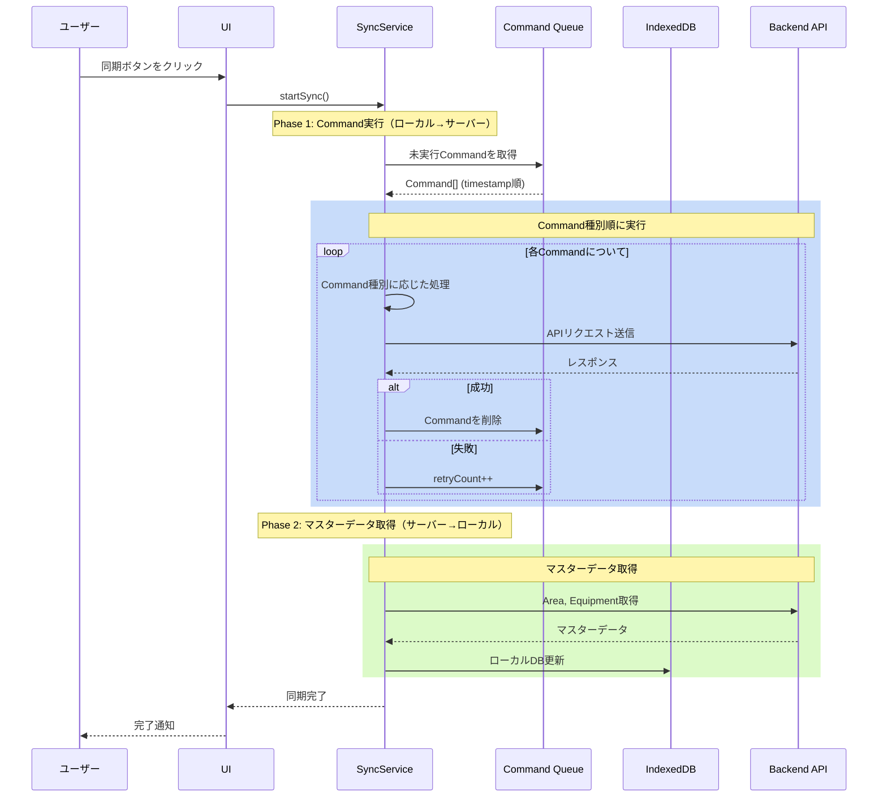

# 同期ロジック詳細設計

このドキュメントでは、Local Bridgeの同期ロジックの詳細な実装方針を説明します。

## 目次

1. [Command方式の概要](#command方式の概要)
2. [同期の全体フロー](#同期の全体フロー)
3. [Command の定義と種類](#commandの定義と種類)
4. [タイムスタンプ戦略](#タイムスタンプ戦略)
5. [エラーハンドリング](#エラーハンドリング)
6. [実装例](#実装例)

## Command方式の概要

### 従来の差分同期との違い

本アプリケーションでは、従来の「差分同期」ではなく **Command パターン（操作ログ形式）** を採用しています。

| 観点           | 差分同期（従来）         | Command 方式（採用）             |
| -------------- | ------------------------ | -------------------------------- |
| 順序管理       | FE で順序を管理          | 不要（timestamp 順に実行）       |
| タイムスタンプ | サーバー発行             | **ローカルで UTC 発行**          |
| 複雑さ         | 差分計算が必要           | 操作をそのまま記録               |
| 再現性         | 差分マージが複雑         | Command 適用順で自然に解決       |
| デバッグ       | 状態の差分から推測       | 操作履歴がそのまま残る           |

### Command方式のメリット

1. **FEの責務がシンプル**: 操作を記録するだけで、順序管理不要
2. **タイムスタンプをローカルで発行**: オフライン中も正確な時刻を記録可能
3. **再現性**: 操作履歴がそのまま残り、デバッグしやすい
4. **サーバー側もシンプル**: Commandを順番に実行するだけ

## 同期の全体フロー

### トリガー

同期は以下のタイミングで実行されます:

1. **ユーザーが「オンラインモード」に切り替え**
2. **ユーザーが「同期」ボタンをクリック**

**自動同期は行いません**。

### 同期の手順



## Commandの定義と種類

### Command スキーマ

```typescript
// 操作の種類を明示的に定義
export type CommandType =
  | 'CREATE_INSPECTION'
  | 'UPDATE_INSPECTION_STATUS'
  | 'CREATE_INSPECTION_ITEM'
  | 'UPDATE_INSPECTION_ITEM_STATUS'
  | 'CREATE_RESULT'
  | 'CREATE_COMMENT'
  | 'CREATE_EVIDENCE'

export type CommandStatus = 'pending' | 'executing' | 'failed'

export interface Command {
  id: string                // CommandのID（UUID）
  type: CommandType         // 操作の種類
  payload: unknown          // 操作対象のデータ
  timestamp: string         // ISO 8601 UTC形式（ローカルで発行）
  status: CommandStatus     // 実行状態
  retryCount: number        // リトライ回数
  lastAttemptAt?: number    // 最後の実行試行日時
  errorMessage?: string     // エラーメッセージ
}
```

### Command実行順序

依存関係を考慮し、以下の順序で実行します:

```
1. CREATE_INSPECTION           (検査作成)
       │
       ▼
2. UPDATE_INSPECTION_STATUS    (検査ステータス更新)
       │
       ▼
3. CREATE_INSPECTION_ITEM      (検査項目作成)
       │
       ▼
4. UPDATE_INSPECTION_ITEM_STATUS (項目ステータス更新)
       │
       ▼
5. CREATE_RESULT               (結果登録)
       │
       ▼
6. CREATE_COMMENT              (コメント追加)
       │
       ▼
7. CREATE_EVIDENCE             (エビデンス追加)
```

### 状態遷移

```
┌──────────────────────────────────────────────────────────────────────────┐
│                       Commandの状態遷移                                   │
└──────────────────────────────────────────────────────────────────────────┘

                              ┌─────────┐
                              │ pending │ ◄── 新規作成時
                              └────┬────┘
                                   │
                                   │ sync() 実行
                                   ▼
                              ┌───────────┐
                              │ executing │ ◄── 実行中
                              └────┬──────┘
                                   │
                    ┌──────────────┴──────────────┐
                    │                             │
               成功 ▼                        失敗 ▼
          ┌─────────────┐                ┌─────────┐
          │   削除      │                │ failed  │
          │ (キューから) │                └────┬────┘
          └─────────────┘                     │
                                              │ retryCount < MAX_RETRY
                                              │
                                    ┌─────────┴─────────┐
                                    │                   │
                               Yes  ▼              No   ▼
                            ┌─────────┐         ┌───────────┐
                            │ pending │         │ 手動対応   │
                            │ (再試行) │         │ が必要    │
                            └─────────┘         └───────────┘


MAX_RETRY_COUNT = 3
```

## タイムスタンプ戦略

### ローカルでUTC発行

Command方式の最大のメリットの一つは、**タイムスタンプをローカルで発行できる**点です。

```typescript
// すべてのタイムスタンプはISO 8601 UTC形式で発行
const now = new Date().toISOString()
// 例: "2025-12-07T10:30:00.000Z"
```

### なぜローカル発行か？

1. **オフライン対応**: サーバーに接続できなくても正確な時刻を記録
2. **順序保証**: タイムスタンプ順にCommandを実行すれば、操作順序が保証される
3. **シンプル**: サーバーでタイムスタンプを発行する必要がない

### UI表示時の変換

```typescript
// 保存時: UTC ISO形式
const createdAt = new Date().toISOString()

// 表示時: ユーザーのタイムゾーンに変換
const displayTime = new Date(createdAt).toLocaleString()
```

## データフロー

### Command記録プロセス

```mermaid
graph TD
    User[ユーザー操作] -->|保存/更新| Repo[Repository Layer]

    subgraph "Command Recording"
        Repo -->|1. 即時保存| LocalDB[ローカルデータ本体<br/>(inspections, results等)]
        Repo -->|2. Command記録| Queue[Command Queue<br/>(commandQueue)]
    end

    LocalDB -->|データ参照| UI[画面表示]
    Queue -->|手動同期トリガー| Server[サーバーAPI]

    note1[UIは即座に更新されるため<br/>ユーザーは待ち時間ゼロ]
    note2[オフラインの間<br/>Commandが溜まり続ける]

    UI -.- note1
    Queue -.- note2
```

### アーキテクチャ比較

```
┌──────────────────────────────────────────────────────────────────────────┐
│                        データフロー比較                                   │
├──────────────────────────────────────────────────────────────────────────┤
│                                                                          │
│  【従来の同期（同期待ち）】                                                │
│                                                                          │
│    User Input ──► API Request ──► Wait... ──► Response ──► Update UI     │
│                        │                          │                      │
│                        └────── ネットワーク遅延 ───┘                      │
│                                (100ms〜数秒)                              │
│                                                                          │
├──────────────────────────────────────────────────────────────────────────┤
│                                                                          │
│  【Local-First (Command方式)】                                           │
│                                                                          │
│    User Input ──┬──► Local DB (本体) ──► Update UI (即座に反映)           │
│                 │    (最新状態の保持)                                      │
│                 │                                                        │
│                 └──► Command Queue ──► 後でサーバーへ送信                  │
│                      (操作ログの蓄積)                                      │
│                                                                          │
│    ※ オフライン時はCommandが溜まり続け、                                    │
│       オンライン切り替え時にまとめて実行されます。                             │
│                                                                          │
└──────────────────────────────────────────────────────────────────────────┘
```

## エラーハンドリング

### リトライ戦略

```typescript
const MAX_RETRY_COUNT = 3

async executeCommand(command: Command): Promise<void> {
  try {
    await commandService.updateStatus(command.id, 'executing')

    // Command種別に応じた処理
    switch (command.type) {
      case 'CREATE_INSPECTION':
        await this.pushInspection(command.payload)
        break
      case 'CREATE_RESULT':
        await this.pushResult(command.payload)
        break
      // ... 他のCommand種別
    }

    // 成功: キューから削除
    await commandService.markAsExecuted(command.id)

  } catch (error) {
    // 失敗: retryCountをインクリメント
    await commandService.updateStatus(command.id, 'failed', error.message)

    if (command.retryCount >= MAX_RETRY_COUNT) {
      console.error(`Command ${command.id} exceeded max retries`)
    }
  }
}
```

### 部分的な失敗

```typescript
async pushLocalChanges(): Promise<SyncResult> {
  const result: SyncResult = {
    success: true,
    syncedCount: 0,
    failedCount: 0,
    errors: [],
  }

  // Command種別ごとに実行（依存関係順）
  for (const commandType of COMMAND_EXECUTION_ORDER) {
    const commands = await commandService.getPendingCommandsByType(commandType)

    for (const command of commands) {
      try {
        await this.executeCommand(command)
        result.syncedCount++
      } catch (error) {
        result.failedCount++
        result.errors.push(`${commandType}: ${error.message}`)
      }
    }
  }

  result.success = result.failedCount === 0
  return result
}
```

## 実装例

### CommandService

```typescript
export class CommandService {
  /**
   * Commandを記録
   */
  async recordCommand(type: CommandType, payload: unknown): Promise<string> {
    const command: Command = {
      id: uuidv4(),
      type,
      payload,
      timestamp: new Date().toISOString(), // ローカルでUTC発行
      status: 'pending',
      retryCount: 0,
    }
    await db.commandQueue.add(command)
    return command.id
  }

  /**
   * 実行待ちのCommandを取得（timestamp順）
   */
  async getPendingCommands(): Promise<Command[]> {
    return db.commandQueue
      .where('status')
      .anyOf(['pending', 'failed'])
      .and((cmd) => cmd.retryCount < MAX_RETRY_COUNT)
      .sortBy('timestamp')
  }

  /**
   * 特定タイプのCommandを取得
   */
  async getPendingCommandsByType(type: CommandType): Promise<Command[]> {
    return db.commandQueue
      .where('type')
      .equals(type)
      .and((cmd) => cmd.status !== 'executing' && cmd.retryCount < MAX_RETRY_COUNT)
      .sortBy('timestamp')
  }

  /**
   * Commandのステータスを更新
   */
  async updateStatus(
    id: string,
    status: CommandStatus,
    errorMessage?: string
  ): Promise<void> {
    const updates: Partial<Command> = {
      status,
      lastAttemptAt: Date.now(),
    }

    if (status === 'failed') {
      const command = await db.commandQueue.get(id)
      if (command) {
        updates.retryCount = command.retryCount + 1
        updates.errorMessage = errorMessage
      }
    }

    await db.commandQueue.update(id, updates)
  }

  /**
   * 実行完了したCommandを削除
   */
  async markAsExecuted(id: string): Promise<void> {
    await db.commandQueue.delete(id)
  }
}
```

### Repository での使用例

```typescript
// MobileInspectionRepositoryImpl.ts

async createInspection(data: InspectionData): Promise<string> {
  const now = new Date().toISOString() // ローカルでUTC発行
  const id = uuidv4()

  const inspection = {
    id,
    ...data,
    createdAt: now,
    updatedAt: now,
  }

  // 1. 即座にローカルDBに保存（楽観的更新）
  await db.inspections.add(inspection)

  // 2. Commandを記録（後でサーバーに反映）
  await commandService.recordCommand('CREATE_INSPECTION', inspection)

  return id
}

async submitResult(result: ResultData): Promise<void> {
  const now = new Date().toISOString()
  const id = uuidv4()

  const newResult = {
    id,
    ...result,
    createdAt: now,
  }

  // 1. 即座にローカルDBに保存
  await db.inspectionResults.add(newResult)

  // 2. Commandを記録
  await commandService.recordCommand('CREATE_RESULT', newResult)

  // 3. Item statusの更新もCommandで記録
  await db.inspectionItems.update(result.inspectionItemId, {
    status: 'in_review',
    updatedAt: now,
  })
  await commandService.recordCommand('UPDATE_INSPECTION_ITEM_STATUS', {
    id: result.inspectionItemId,
    status: 'in_review',
    updatedAt: now,
  })
}
```

### UI での未実行Command数表示

```tsx
// SyncButton.tsx

export const SyncButton = () => {
  const { pendingCount, hasPendingChanges, sync, isSyncing } = useSync()

  return (
    <Button onClick={sync} disabled={isSyncing}>
      {isSyncing ? (
        <RefreshCw className="animate-spin" />
      ) : hasPendingChanges ? (
        <CloudOff />
      ) : (
        <CheckCircle />
      )}
      <span>{hasPendingChanges ? `未同期: ${pendingCount}件` : '同期済'}</span>
    </Button>
  )
}
```

## まとめ

### 同期の原則

1. **手動トリガー** - ユーザーが明示的に同期を開始
2. **Command記録** - 操作をそのままログとして記録
3. **ローカルでタイムスタンプ発行** - UTC ISO形式で即座に発行
4. **依存関係順に実行** - 親データ→子データの順序で処理
5. **リトライ** - 一時的なネットワークエラーに対応（最大3回）
6. **透明性** - 同期結果をユーザーに明示

### パフォーマンス考慮事項

- **即時UI更新**: ローカルDBへの書き込みは即座に完了
- **バックグラウンド同期**: APIリクエストはユーザー操作をブロックしない
- **プログレス表示**: 長時間かかる場合は進捗を表示

### セキュリティ

- **認証トークン**: すべてのAPI呼び出しに認証トークンを付与
- **HTTPS**: すべての通信はHTTPSで暗号化
