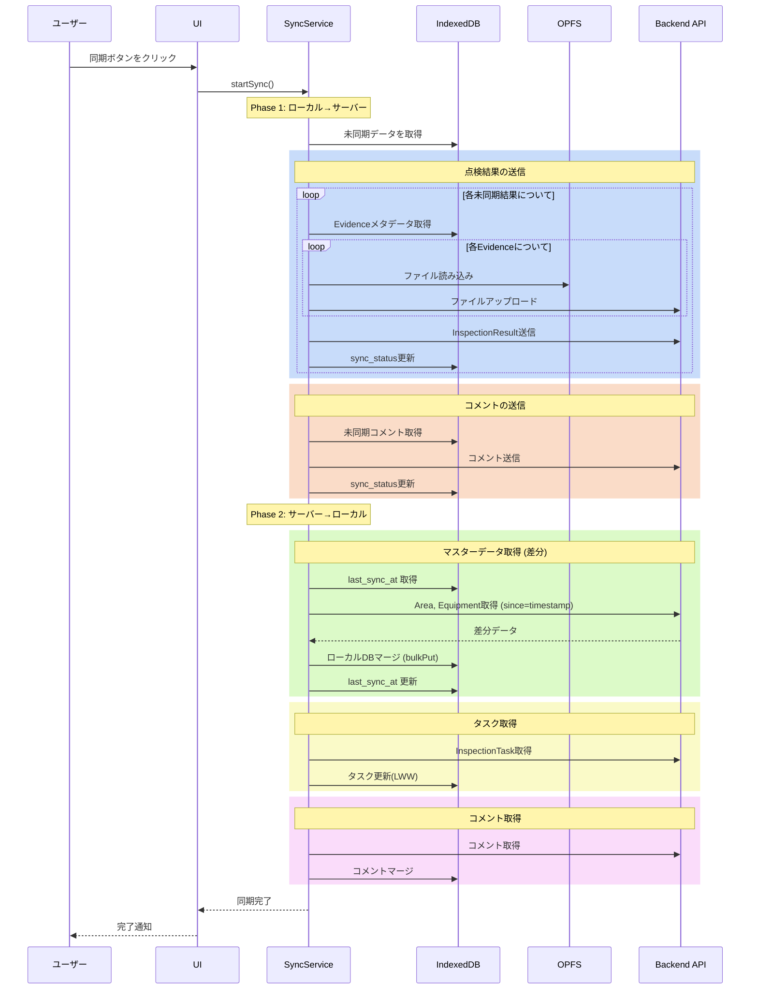

# 同期ロジック詳細設計

このドキュメントでは、Local Bridgeの同期ロジックの詳細な実装方針を説明します。

## 目次

1. [同期の全体フロー](#同期の全体フロー)
2. [データ種別ごとの同期戦略](#データ種別ごとの同期戦略)
3. [同期状態の管理](#同期状態の管理)
4. [エラーハンドリング](#エラーハンドリング)
5. [実装例](#実装例)

## 同期の全体フロー

### トリガー

同期は以下のタイミングで実行されます:

1. **ユーザーが「オンラインモード」に切り替え**
2. **ユーザーが「同期」ボタンをクリック**

**自動同期は行いません**。

### 同期の手順



## データ種別ごとの同期戦略

### 1. マスターデータ (Area, Equipment)

**方向**: Server → Client (一方向)

**戦略**: Incremental Sync (差分同期)

```typescript
async syncMasterData(): Promise<void> {
  // 1. 最後の同期日時を取得
  const lastSyncSetting = await db.settings.get('last_master_sync_at')
  const lastSyncAt = lastSyncSetting?.value as number | undefined

  // 2. 差分取得 (sinceパラメータ付与)
  const areasUrl = lastSyncAt
    ? `${API_BASE_URL}/master/areas?since=${lastSyncAt}`
    : `${API_BASE_URL}/master/areas`

  const areas = await api.get(areasUrl)

  // 3. ローカルDBに反映
  if (lastSyncAt && areas.length > 0) {
    // 差分マージ (既存レコードを更新、新規レコードを追加)
    await db.areas.bulkPut(areas)
    console.log(`↻ マスターデータ更新: ${areas.length}件`)
  } else if (!lastSyncAt) {
    // 初回同期は全置換
    await db.areas.clear()
    await db.areas.bulkAdd(areas)
    console.log(`✓ マスターデータ初期化: ${areas.length}件`)
  }

  // 4. 同期日時を更新
  await db.settings.put({ key: 'last_master_sync_at', value: Date.now() })
}
```

**理由**:

- マスターデータは頻繁に変更されないため、毎回全件取得するのは帯域の無駄
- タイムスタンプベースの差分同期により、通信量を95%以上削減可能
- `bulkPut` を使用することで、Insert/Update を自動判別してマージ

### 2. InspectionTask

**方向**: Server → Client (一方向)

**戦略**: Last-Write-Wins (LWW) with Timestamp

```typescript
async syncTasks(): Promise<void> {
  // サーバーから全タスクを取得
  const serverTasks = await api.getTasks()

  for (const serverTask of serverTasks) {
    const localTask = await db.inspectionTasks.get(serverTask.id)

    if (!localTask) {
      // ローカルに存在しない → 新規追加
      await db.inspectionTasks.add(serverTask)
      console.log(`+ 新規タスク: ${serverTask.id}`)
    } else if (serverTask.updatedAt > localTask.updatedAt) {
      // サーバーの方が新しい → 上書き
      await db.inspectionTasks.update(serverTask.id, serverTask)
      console.log(`↻ タスク更新: ${serverTask.id} (${localTask.status} → ${serverTask.status})`)
    } else if (localTask.updatedAt > serverTask.updatedAt) {
      // ローカルの方が新しい → サーバーに送信
      await api.updateTask(localTask.id, localTask)
      console.log(`↑ タスク送信: ${localTask.id}`)
    }
    // updatedAtが同じ → 何もしない
  }
}
```

**注意点**:

- タイムスタンプはクライアント生成のため、時刻のずれに注意
- 重要な場合は楽観的ロック(`version`フィールド)を検討

### 3. InspectionResult

**方向**: Client → Server (一方向)

**戦略**: Append-Only (追記のみ)

```typescript
async syncResults(): Promise<SyncStats> {
  const stats = { sent: 0, failed: 0 }

  // sync_status が 'pending' の結果を取得
  const pendingResults = await db.inspectionResults
    .where('sync_status')
    .equals('pending')
    .toArray()

  for (const result of pendingResults) {
    try {
      // 1. Evidenceのアップロード
      const evidences = await db.evidences
        .where('resultId')
        .equals(result.id)
        .toArray()

      const uploadedEvidenceIds: string[] = []

      for (const evidence of evidences) {
        // OPFSからファイル読み込み
        const file = await opfs.getFile(evidence.filePath)

        // サーバーにアップロード
        const serverFileUrl = await api.uploadEvidence(file, {
          resultId: result.id,
          type: evidence.type,
          mimeType: evidence.mimeType,
        })

        // Evidenceメタデータを更新(serverFileUrlを保存)
        await db.evidences.update(evidence.id, {
          serverFileUrl,
          sync_status: 'synced',
        })

        uploadedEvidenceIds.push(evidence.id)
      }

      // 2. InspectionResultの送信
      await api.createInspectionResult({
        ...result,
        evidenceIds: uploadedEvidenceIds,
      })

      // 3. sync_statusを更新
      await db.inspectionResults.update(result.id, {
        sync_status: 'synced',
        syncedAt: Date.now(),
      })

      stats.sent++
      console.log(`✓ 結果送信完了: ${result.id}`)

    } catch (error) {
      // エラー時はstatusを'error'に
      await db.inspectionResults.update(result.id, {
        sync_status: 'error',
        syncError: error.message,
      })

      stats.failed++
      console.error(`✗ 結果送信失敗: ${result.id}`, error)
    }
  }

  return stats
}
```

**重要**:

- 一度送信した結果は再送信しない(`sync_status: 'synced'`)
- エラー時は`sync_status: 'error'`にして、ユーザーに通知
- Evidenceを先にアップロードしてから、Resultを送信

### 4. InspectionComment

**方向**: Bi-directional (双方向)

**戦略**: Merge by ID (IDでマージ)

```typescript
async syncComments(): Promise<void> {
  // Phase 1: ローカル → サーバー
  const localComments = await db.inspectionComments.toArray()
  const unsyncedComments = localComments.filter(c => c.sync_status === 'pending')

  for (const comment of unsyncedComments) {
    try {
      await api.createComment(comment)
      await db.inspectionComments.update(comment.id, {
        sync_status: 'synced',
      })
      console.log(`↑ コメント送信: ${comment.id}`)
    } catch (error) {
      console.error(`✗ コメント送信失敗: ${comment.id}`, error)
    }
  }

  // Phase 2: サーバー → ローカル
  const serverComments = await api.getComments()
  const localCommentIds = new Set(localComments.map(c => c.id))

  const newComments = serverComments.filter(c => !localCommentIds.has(c.id))

  if (newComments.length > 0) {
    await db.inspectionComments.bulkAdd(
      newComments.map(c => ({
        ...c,
        sync_status: 'synced',
      }))
    )
    console.log(`↓ 新規コメント受信: ${newComments.length}件`)
  }
}
```

**理由**:

- UUIDによりID衝突は発生しない
- 両方のコメントを保持することで情報が失われない

### 5. Evidence (ファイル)

**方向**: Client → Server (一方向)

**戦略**: Upload Once, Keep Metadata

```typescript
async uploadEvidence(
  file: File,
  metadata: {
    resultId: string
    type: 'image' | 'video'
    mimeType: string
  }
): Promise<string> {
  // 1. Presigned URLを取得
  const { uploadUrl, fileUrl } = await api.getPresignedUrl({
    fileName: `${uuidv4()}.${file.name.split('.').pop()}`,
    contentType: file.type,
  })

  // 2. S3などに直接アップロード
  await fetch(uploadUrl, {
    method: 'PUT',
    body: file,
    headers: {
      'Content-Type': file.type,
    },
  })

  // 3. サーバーのファイルURLを返す
  return fileUrl
}
```

**OPFS管理**:

```typescript
// オプション1: 同期成功後、OPFSファイルを削除(省スペース)
async cleanupSyncedEvidences(): Promise<void> {
  const syncedEvidences = await db.evidences
    .where('sync_status')
    .equals('synced')
    .toArray()

  for (const evidence of syncedEvidences) {
    try {
      await opfs.deleteFile(evidence.filePath)
      console.log(`🗑 OPFS削除: ${evidence.filePath}`)
    } catch (error) {
      console.warn(`OPFS削除失敗: ${evidence.filePath}`, error)
    }
  }
}

// オプション2: 保持(オフライン時の再表示用)
// → 何もしない
```

## 同期進捗の可視化

大量のデータを同期する際、ユーザーに安心感を与えるために進捗状況を可視化します。

### 実装アプローチ

1. **Zustand Store での状態管理**:
   - `progress` state (current, total, message) を管理
   - UI コンポーネントはこの state をサブスクライブして表示

2. **SyncService からの通知**:
   - `pushLocalChanges` や `syncMasterData` メソッドに `onProgress` コールバックを渡す
   - 処理が進むごとにコールバックを呼び出す

```typescript
// SyncService.ts
async pushLocalChanges(onProgress?: SyncProgressCallback): Promise<SyncResult> {
  const totalCount = await syncQueueService.getPendingCount()
  let processedCount = 0

  // 各ステップで進捗を更新
  await this.pushQueuedItems('inspection', result, (count) => {
    processedCount += count
    onProgress?.(processedCount, totalCount, '検査データを同期中...')
  })

  // ...
}
```

3. **UI での表示**:
   - プログレスバーとパーセンテージを表示
   - 「X / Y 件」のような具体的な数字を表示

## 同期状態の管理

### sync_status フィールド

各エンティティに`sync_status`フィールドを追加:

```typescript
type SyncStatus = 'pending' | 'synced' | 'error'

interface InspectionResult {
  // ... 他のフィールド
  sync_status: SyncStatus
  syncedAt?: number // 同期完了日時
  syncError?: string // エラーメッセージ
}
```

### IndexedDBスキーマ更新

```typescript
this.version(4).stores({
  inspectionResults: 'id, taskId, sync_status, syncedAt',
  inspectionComments: 'id, taskId, sync_status',
  evidences: 'id, resultId, sync_status',
})
```

## エラーハンドリング

### リトライ戦略

```typescript
async syncWithRetry(maxRetries = 3): Promise<void> {
  for (let attempt = 1; attempt <= maxRetries; attempt++) {
    try {
      await this.sync()
      return // 成功
    } catch (error) {
      console.error(`同期失敗 (試行 ${attempt}/${maxRetries}):`, error)

      if (attempt === maxRetries) {
        // 最終試行も失敗
        throw new Error(`同期に失敗しました: ${error.message}`)
      }

      // 指数バックオフ
      const delay = Math.min(1000 * Math.pow(2, attempt - 1), 10000)
      await new Promise(resolve => setTimeout(resolve, delay))
    }
  }
}
```

### 部分的な失敗

```typescript
async sync(): Promise<SyncResult> {
  const result: SyncResult = {
    success: true,
    masterData: { success: false },
    tasks: { success: false },
    results: { success: false, sent: 0, failed: 0 },
    comments: { success: false, sent: 0, received: 0 },
  }

  try {
    await this.syncMasterData()
    result.masterData.success = true
  } catch (error) {
    console.error('マスターデータ同期失敗:', error)
    result.success = false
  }

  try {
    await this.syncTasks()
    result.tasks.success = true
  } catch (error) {
    console.error('タスク同期失敗:', error)
    result.success = false
  }

  try {
    const stats = await this.syncResults()
    result.results = { success: true, ...stats }
  } catch (error) {
    console.error('結果同期失敗:', error)
    result.success = false
  }

  try {
    const stats = await this.syncComments()
    result.comments = { success: true, ...stats }
  } catch (error) {
    console.error('コメント同期失敗:', error)
    result.success = false
  }

  return result
}
```

## 実装例

### SyncService クラス

```typescript
export class SyncService {
  constructor(
    private db: LocalBridgeDatabase,
    private opfs: OPFSStorage,
    private api: APIClient
  ) {}

  async sync(): Promise<SyncResult> {
    console.log('🔄 同期開始...')
    const startTime = Date.now()

    const result = await this.syncWithRetry()

    const duration = Date.now() - startTime
    console.log(`✓ 同期完了 (${duration}ms)`)

    return result
  }

  private async syncWithRetry(maxRetries = 3): Promise<SyncResult> {
    // ... リトライロジック
  }

  private async syncMasterData(): Promise<void> {
    // ... マスターデータ同期
  }

  private async syncTasks(): Promise<void> {
    // ... タスク同期
  }

  private async syncResults(): Promise<SyncStats> {
    // ... 結果同期
  }

  private async syncComments(): Promise<CommentSyncStats> {
    // ... コメント同期
  }
}
```

### 使用例

```typescript
// Zustand Store
interface SyncStore {
  isSyncing: boolean
  lastSyncResult: SyncResult | null
  sync: () => Promise<void>
}

export const useSyncStore = create<SyncStore>((set, get) => ({
  isSyncing: false,
  lastSyncResult: null,

  sync: async () => {
    set({ isSyncing: true })

    try {
      const syncService = new SyncService(db, opfs, api)
      const result = await syncService.sync()

      set({ lastSyncResult: result })

      // 通知
      if (result.success) {
        toast.success('同期が完了しました')
      } else {
        toast.warning('一部のデータの同期に失敗しました')
      }
    } catch (error) {
      toast.error(`同期に失敗しました: ${error.message}`)
    } finally {
      set({ isSyncing: false })
    }
  },
}))
```

### UI コンポーネント

```tsx
export const SyncButton: React.FC = () => {
  const { isSyncing, lastSyncResult, sync } = useSyncStore()

  return (
    <div>
      <button onClick={sync} disabled={isSyncing} className="btn btn-primary">
        {isSyncing ? (
          <>
            <Loader className="animate-spin" />
            同期中...
          </>
        ) : (
          <>
            <RefreshCw />
            同期
          </>
        )}
      </button>

      {lastSyncResult && (
        <div className="mt-2 text-sm">
          <p>✓ {lastSyncResult.results.sent}件の結果を送信</p>
          <p>✓ {lastSyncResult.comments.received}件のコメントを受信</p>
          {lastSyncResult.results.failed > 0 && (
            <p className="text-red-500">✗ {lastSyncResult.results.failed}件の送信に失敗</p>
          )}
        </div>
      )}
    </div>
  )
}
```

## 同期キューによる永続化

### 概要

同期キューは、ローカルでの変更を確実にサーバーへ同期するための仕組みです。アプリ再起動後も未同期データを保持し、ネットワーク復旧時に確実に同期を完了させます。

### アーキテクチャ

```
┌─────────────────────────────────────────────────────────────────────────┐
│                              User Action                                 │
│                     (検査結果を保存、コメント追加など)                      │
└─────────────────────────────────────────────────────────────────────────┘
                                      │
                                      ▼
┌─────────────────────────────────────────────────────────────────────────┐
│                          Repository Layer                                │
│                   (MobileInspectionRepositoryImpl)                       │
│                                                                          │
│   ┌─────────────────────┐     ┌─────────────────────┐                   │
│   │  1. ローカルDBに保存  │ ──► │  2. 同期キューに追加  │                   │
│   │   (楽観的更新)        │     │   (永続化)           │                   │
│   └─────────────────────┘     └─────────────────────┘                   │
└─────────────────────────────────────────────────────────────────────────┘
                                      │
                    ┌─────────────────┴─────────────────┐
                    ▼                                   ▼
          ┌─────────────────┐                ┌─────────────────┐
          │   IndexedDB      │                │   IndexedDB      │
          │   (データ本体)    │                │   (syncQueue)    │
          │                  │                │                  │
          │  - inspections   │                │  id: string      │
          │  - results       │                │  type: string    │
          │  - comments      │                │  entityId: string│
          │  - evidences     │                │  payload: object │
          └─────────────────┘                │  status: pending │
                                             │  retryCount: 0   │
                                             └─────────────────┘
```

### データフロー

```
┌──────────────────────────────────────────────────────────────────────────┐
│                        データフロー比較                                   │
├──────────────────────────────────────────────────────────────────────────┤
│                                                                          │
│  【従来の同期（同期待ち）】                                                │
│                                                                          │
│    User Input ──► API Request ──► Wait... ──► Response ──► Update UI     │
│                        │                          │                      │
│                        └────── ネットワーク遅延 ───┘                      │
│                                (100ms〜数秒)                              │
│                                                                          │
├──────────────────────────────────────────────────────────────────────────┤
│                                                                          │
│  【Local-First（楽観的更新）】                                            │
│                                                                          │
│    User Input ──┬──► IndexedDB ──► Update UI (即座に反映)                │
│                 │         │                                              │
│                 │         ▼                                              │
│                 └──► SyncQueue ──► 後でサーバーへ送信                     │
│                                                                          │
│    ※ UI更新は即座（<10ms）、サーバー同期は非同期で実行                     │
│                                                                          │
└──────────────────────────────────────────────────────────────────────────┘
```

### SyncQueueItem スキーマ

```typescript
export type SyncQueueItemType = 'inspection' | 'inspectionItem' | 'result' | 'comment' | 'evidence'

export type SyncQueueStatus = 'pending' | 'syncing' | 'failed'

export interface SyncQueueItem {
  id: string // キューアイテムのID（UUID）
  type: SyncQueueItemType // エンティティの種類
  entityId: string // 対象エンティティのID
  payload: unknown // 同期するデータの全体
  status: SyncQueueStatus // 同期状態
  retryCount: number // リトライ回数
  createdAt: number // キュー追加日時
  lastAttemptAt?: number // 最後の同期試行日時
  errorMessage?: string // エラーメッセージ
}
```

### 状態遷移

```
┌──────────────────────────────────────────────────────────────────────────┐
│                       同期キューの状態遷移                                │
└──────────────────────────────────────────────────────────────────────────┘

                              ┌─────────┐
                              │ pending │ ◄── 新規作成時
                              └────┬────┘
                                   │
                                   │ sync() 実行
                                   ▼
                              ┌─────────┐
                              │ syncing │ ◄── 同期処理中
                              └────┬────┘
                                   │
                    ┌──────────────┴──────────────┐
                    │                             │
               成功 ▼                        失敗 ▼
          ┌─────────────┐                ┌─────────┐
          │   削除      │                │ failed  │
          │ (キューから) │                └────┬────┘
          └─────────────┘                     │
                                              │ retryCount < MAX_RETRY
                                              │
                                    ┌─────────┴─────────┐
                                    │                   │
                               Yes  ▼              No   ▼
                            ┌─────────┐         ┌───────────┐
                            │ pending │         │ 手動対応   │
                            │ (再試行) │         │ が必要    │
                            └─────────┘         └───────────┘


MAX_RETRY_COUNT = 3
```

### 同期順序

依存関係を考慮し、以下の順序で同期を実行します:

```
1. inspection      (検査)
       │
       ▼
2. inspectionItem  (検査項目) ── inspectionId で紐付け
       │
       ▼
3. result          (検査結果) ── inspectionItemId で紐付け
       │
       ▼
4. comment         (コメント) ── inspectionItemId で紐付け
       │
       ▼
5. evidence        (証跡)     ── resultId で紐付け
```

### SyncQueueService 実装

```typescript
export class SyncQueueService {
  private readonly MAX_RETRY_COUNT = 3

  /**
   * 同期キューにアイテムを追加
   */
  async enqueue(type: SyncQueueItemType, entityId: string, payload: unknown): Promise<string> {
    const id = uuidv4()
    await db.syncQueue.add({
      id,
      type,
      entityId,
      payload,
      status: 'pending',
      retryCount: 0,
      createdAt: Date.now(),
    })
    return id
  }

  /**
   * 未同期アイテムを取得
   */
  async getPendingItems(): Promise<SyncQueueItem[]> {
    return db.syncQueue
      .where('status')
      .anyOf(['pending', 'failed'])
      .filter((item) => item.retryCount < this.MAX_RETRY_COUNT)
      .toArray()
  }

  /**
   * ステータス更新
   */
  async updateStatus(id: string, status: SyncQueueStatus, errorMessage?: string): Promise<void> {
    await db.syncQueue.update(id, {
      status,
      lastAttemptAt: Date.now(),
      ...(status === 'failed' && {
        retryCount: (await db.syncQueue.get(id))!.retryCount + 1,
        errorMessage,
      }),
    })
  }

  /**
   * 同期完了後にキューから削除
   */
  async markAsSynced(id: string): Promise<void> {
    await db.syncQueue.delete(id)
  }
}
```

### Repository での使用例

```typescript
// MobileInspectionRepositoryImpl.ts

async saveResult(result: InspectionResult): Promise<void> {
  const newResult = {
    id: uuidv4(),
    ...result,
    createdAt: Date.now(),
  }

  // 1. 即座にローカルDBに保存（楽観的更新）
  await db.inspectionResults.add(newResult)

  // 2. 同期キューに追加（後で同期）
  await syncQueueService.enqueue('result', newResult.id, newResult)
}
```

### UI での未同期件数表示

```tsx
// SyncButton.tsx

export const SyncButton = () => {
  const { pendingCount, hasPendingChanges, sync, isSyncing } = useSync()

  return (
    <Button onClick={sync} disabled={isSyncing}>
      {isSyncing ? (
        <RefreshCw className="animate-spin" />
      ) : hasPendingChanges ? (
        <CloudOff />
      ) : (
        <CheckCircle />
      )}
      <span>{hasPendingChanges ? `未同期: ${pendingCount}件` : '同期済'}</span>
    </Button>
  )
}
```

## まとめ

### 同期の原則

1. **手動トリガー** - ユーザーが明示的に同期を開始
2. **部分的な成功を許容** - 一部が失敗しても他は成功
3. **リトライ** - 一時的なネットワークエラーに対応
4. **透明性** - 同期結果をユーザーに明示
5. **履歴保持** - すべてのデータを履歴として保持

### パフォーマンス考慮事項

- **バッチ処理**: 複数のコメントをまとめて送信
- **並列処理**: 独立したデータは並列で同期
- **プログレス表示**: 長時間かかる場合は進捗を表示
- **バックグラウンド処理**: Web Workerの活用を検討

### セキュリティ

- **認証トークン**: すべてのAPI呼び出しに認証トークンを付与
- **Presigned URL**: ファイルアップロードはPresigned URLを使用
- **HTTPS**: すべての通信はHTTPSで暗号化
